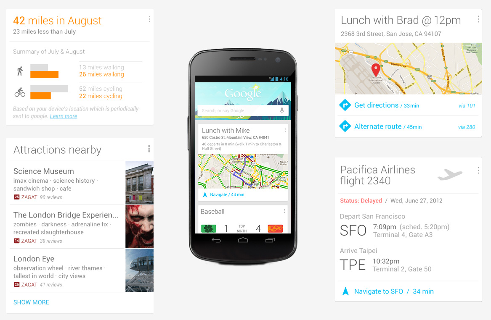

## Real-Time Web Apps: Now & Beyond

## Introduction

I've spoken at a couple of FOWA London events, but it's great to be at FOWA in Boston. I was especially excited to be involved when I took a look at this year's schedule.

In that schedule you'll see 5 talks specifically on real-time and 4 talks on IoT which inherently use real-time technology for signalling and messaging. There are 21 talks in total so that's over 40% of the talks at FOWA Boston 2015 that cover real-time!

So, we're all here as part of the **Real-Time Revolution**! The reason I say this is that I've been working with real-time technologies since 2001 and I've seen usage trends. Right now it feels as if we're in the midst of a surge in the usage of real-time technology. Is it driven by IoT? It's a factor, yes, but I don't believe it's the only driving force. I also believe that the upwards trend for real-time technologies is going to continue into the future and is becoming fundamental to may applications and the user experiences that they delivery.

What I'd like to cover in this talk is the past, present and future of real-time technology; how real-time technology got to where it is today, how it's being used right now in a world of real-time communication and collaboration, why I see this trend continuing and where I think it'll lead us in the future.

## About Me

My name's Phil Leggetter and I work at a company called [Pusher](https://pusher.com). Pusher is a real-time messaging API service that helps you build real-time apps using the technology you're most comfortable with.

As I said, I've been working with real-time technology since 2001. Initially building SDKs to help developers build web trading platforms. I discovered that what I really enjoyed doing was learning about new technology, creating new things with that technology and then sharing my findings and thoughts. This was apparently what an evangelist or advocate does, so that type of role was the right choice for me. So my focus is really to share information and ideas about real-time technology and what it makes possible.

## Setting the scene (past)

I first gave this talk back in 2014 and I plan to continue doing so. Technology evolves, as does this talk. So, if you'd like to see where I thought things were going back in [2014 the video is on YouTube](https://www.youtube.com/watch?v=E2GhY9NaDkQ).

### "Real-Time Web Apps"

This talk has the words "real-time web apps" in it. But is that really what we're talking about. "Web" makes us think of the "World Wide Web":

> The World Wide Web (www) is an information space where documents and other web resources are identified by URLs, interlinked by hypertext links, and can be accessed via the Internet

<small>Source: <a href="https://en.wikipedia.org/wiki/World_Wide_Web">WWW on Wikipedia</a></small>

### Real-time Internet apps

What we really mean is "real-time Internet apps". Although real-time technology was initially focused on pushing data to web browsers we need to think beyond the browser client. And beyond just HTTP accessible resources and hyperlinks.

### Is it really "Real-Time"?

So, you're not going to use the types of real-time framework we're going to talk about to control something like the warp core of the Starship Enterprise. In that scenario there's an absolute **hard** deadline between an event taking place - "the warp core is unstable" - and the safety system receiving that event and ejecting the core. If that hard deadline isn't met then the warp core explodes and everybody on the Enterprise dies.


When it comes to the Internet we're talking about **firm** and **soft** data delivery deadlines. Systems that use this type of framework are aware they're using the Internet as the communications network so have to provide mechanisms for dealing with data that is delivered later than expected; data that isn't delivered by a deadline doesn't cripple the system, the experience is simply degraded.

### When do we need real-time? (Data)

Now that we've identified what we mean by real-time in the context of Internet apps it makes sense to ask the question "When do we need real-time?".

There are two parts to this. The first is simply; **when there's value in using and delivering data** the instant that it's created. A trading application is a good example of where the sooner the data is delivered the more valuable it potentially is.

As an aside, every application we build does have real-time data.

### Aside: Every app has real-time data

I've often seen people share their discovering of a real-time service or framework and exclaim "now to find something to build with this". What I think people fail to realise is that the applications they are working on right now already have real-time data in them, and this can be used to add real-time features to that app.

The real-time web is sometimes referred to as "The Evented Web". With this in mind, if you can identify the events that take place within your application you can then find the real-time data.

Any time new data is created, existing data is update or even deleted within an application there is real-time data. A great place to find real-time data is at the interaction point with a database; Create, Update and Delete operations all represent events with associated real-time data.

You can take the idea of interacting with databases and extend it to consider any interaction between any two system components. Each interaction is an event with an associated data payload.

Finally, you have users interacting with your application. Each interaction contains information about what that user is doing and who they are; each interaction is a real-time event with real-time data!

And, yes. I've previously done a talk entirely focused on identifying and exposing the real-time data within your apps.

<iframe width="853" height="480" src="https://www.youtube.com/embed/rk5Jm1IHxlI" frameborder="0" allowfullscreen></iframe>

### When do we need real-time? (UX)

As well as benefiting from the timely nature of data there's also a need for real-time when it improves or is key to the user experience of an application.

Communication applications are the simplest and most obvious example of this. The experience provided by an instant messaging or video chat application relies absolutely on the instant delivery of messages, audio and pictures. Without real-time these applications are useless.

### When do we need real-time? (Summary)

So, real-time is required whenever there's a need or demand for instantly up to date information or to maintain context during and interactive and engaging user experience.

But these aren't new needs or demands. There has long been the need to get up to date information and provide interactive user experiences. The latter used to have to be in-person because the Internet wasn't the communications platform that it now is.

### The Internet

Developers have long strived to build real-time Internet applications. However, the effort required to build something truly innovative was very high. Look at all the "Effort" we have to do in order to reach innovation given the fundamentals of the Internet.


However, this doesn't stop us developers. This is [Talkomatic](https://en.wikipedia.org/wiki/Talkomatic), a real-time chat application build back in in 1973.


So back in 1973 we were trying to build real-time apps!

Eventually we got HTTP. It improved things, but still didn't allow us to build all the applications we wanted to.


Who remembers Yahoo! chat? I'm pretty sure this had an embedded Java applet because the app has voice and sound. As developers we're having to work around runtime and platform limitations to build the sort of functionality we want within our Internet apps.


In addition to chat we started to see financial focused applications making their way into web browsers. Fat clients like the Reuters 3000 Xtra dominated the desktop, with a heavy license fee.


But every computer had a web browser so if you could build a similar app that ran in a web browser you'd eliminate a significant cost.


Developers - driven by clear business benefits - wanted to build real-time apps on the Internet, but we had to work around the fundamentals that the web and it's client applications offered. The app above - yet again - required an embedded Java applet to offer most of its functionality.

HTTP was built with the [request and response paradigm](https://en.wikipedia.org/wiki/Request%E2%80%93response) in mind. It wasn't built to facilitate the instant delivery of data from server to client over a persisent connection; but that's what we wanted to do.

Until the standardisation of the [XMLHttpRequest object](https://en.wikipedia.org/wiki/XMLHttpRequest) it was even difficult to make a request from a web brower to a server without refreshing the web page. There were other limitations too, such as a maximum of 2 connections per domain from a single browser process, no cross origin request support and general cross browser incompatibilities.

But, as we've seen, this didn't stop us. We embedded Java applets, we hacked with Frames and IFrames, with ActiveX objects, and generally hacked HTTP to simulate real-time bi-directional communication between clients and server.

## 5 things that have made real-time mainstream

But we got there and real-time functionality eventually made its way into mainstream applications. The persistent effort paid off. Here, in my opinion, are five things that took real-time technology and experiences from a niche requirement to demonstrating mainstream benefit.

### 1. Social apps

Although not strictly real-time, social applications such as [FriendFeed](https://en.wikipedia.org/wiki/FriendFeed) and much more successfully, Twitter demonstrated the value of providing a near real-time conversation platform. Not only could you interact with others in near real-time, you could also find new information just seconds after it had been posted. It was in fact the real-time search features that got the [attention of Robert Scoble back in 2009](http://scobleizer.com/is-the-real-time-web-a-threat-to-google-search/) who was instrumental in demonstrating the value of real-time social platforms.


Not only did social platforms demonstrate the value of the technology, they also translated a fundamental real-time technology concept of subscribing to data into an accepted user action; the "Follow" button is a clear subscription and registration of interest in data from a particular user.

### 2. Improved server power

Servers are simply much more powerful than they used to be; processors and memory are faster and cheaper. This means more data can be stored in-memory and processed and scaling is more approachable (although still not simple). This all resulted in the [C10k problem](https://en.wikipedia.org/wiki/C10k_problem) - maintaining 10,000 concurrent connections - becoming much less of an issue.

### 3. Web browser capabilities and consistency

As discussed, at this point in time the web was the focal application runtime. It's where the developers were putting the effort and in response (eventually) things improved.

The XMLHttpRequest object became standardised across browsers, [CORS (Cross Origin Resource Sharing)](https://developer.mozilla.org/en-US/docs/Web/HTTP/Access_control_CORS) was standardised and [Server-Sent Events](https://developer.mozilla.org/en-US/docs/Web/API/Server-sent_events/Using_server-sent_events) and the [EventSource API](https://developer.mozilla.org/en-US/docs/Web/API/EventSource) was introduced to standardise HTTP push mechanisms.

[WebSocket](https://pusher.com/websockets) was produced as both a protocol and API to enable a standard TCP connection on the web, perfect for real-time bi-directional communication. And even the approaches to hacks became standardised so older technologies could still benefit from real-time functionality.

Peer-to-peer communication has also been catered for with the introduction of [WebRTC](https://developer.mozilla.org/en-US/docs/Web/Guide/API/WebRTC), supporting data, audio and video over a direct connection.


These additions move us within touching distance of innovation, with the requirement of much less effort on our behalf; we're starting to have all the fundamentals we need to build the apps we want to.

### Aside: Beyond web browsers

At this point we can start to think past the web browser as our application runtime. Standards mean that any client - any runtime - has the potential to use these technologies and contribute to our Internet of real-time apps.

### 4. Increased software choice

Back in 2001 there were very few software vendors that offered some sort of real-time framework. Not only that, but these were proprietary solutions that were considered serious intellectual property and there was no thought of openly sharing.

Fast forward to 2010 and the choice had increased. A few years later and there was a lot to choose from. Where previous solutions were only available to C, Java or Perl (yes, Perl) runtimes, there were now options for Python, Ruby, Java, .NET and - of course - JavaScript with the Node.JS runtime.

Not only had the self-hosted option choice increased, but "the cloud" had made real-time technology accessible to runtimes that would still otherwise struggle to manage and maintain thousands of persistent connections. Beyond runtime capabilities, the cloud also offered benefits of scale, security and maintenance allowing developers to focus on application features rather than infrastructure. Maybe you've heard of this real-time messaging company called [Pusher](https://pusher.com)?

### 5. Massive increase in Internet usage

Internet usage continues to grow so it's no surprise that this has been a large contributing factor to the usage of real-time frameworks and making real-time a mainstream topic.

In mid 2014 I compiled some of my own statistics. I found that in a regular day of Internet usage there are:

* [200 billion emails sent][email-stat]
* [7 million blog posts written][wordpress-stat]<sup>†</sup>
* [500 million tweets][twitter-stat]
* [55 million Facebook status updates][facebook-stat]
* [5 billion Google+ +1's][googleplus-stat]
* [60 million Instagram photos posted][instagram-stat]
* [2 billion minutes spent on Skype][skype-stat]
* [33 million hours of Netflix watched][netflix-stat]
* [200 million hours of YouTube watched](youtube-stat)

[email-stat]:http://www.radicati.com/wp/wp-content/uploads/2013/04/Email-Statistics-Report-2013-2017-Executive-Summary.pdf
[twitter-stat]:http://abcnews.go.com/Business/twitter-ipo-filing-reveals-500-million-tweets-day/story?id=20460493
[facebook-stat]:http://blog.kissmetrics.com/facebook-statistics/
[googleplus-stat]:http://www.mediabistro.com/alltwitter/social-media-stats-2012_b30651
[wordpress-stat]:http://wordpress.com/stats/posting/
[instagram-stat]:http://instagram.com/press/
[youtube-stat]:http://www.youtube.com/yt/press/statistics.html
[netflix-stat]:http://blog.netflix.com/2014/01/new-isp-performance-data-for-december.html
[skype-stat]:http://blogs.skype.com/2013/04/03/thanks-for-making-skype-a-part-of-your-daily-lives-2-billion-minutes-a-day/

Each year, [Mary Meeker](http://www.kpcb.com/partner/mary-meeker) of KPCB compiles an Internet Trends report. In 2015 she highlighted the increasing amount of time that adults in the USA spend online - an average of 5.6 hours a day.


Her research uncovered that over 6 of the top 10 most used applications were messaging applications.


Many of these messaging apps are in fact "Instant Messaging" apps, chat applications; powered by real-time technology.

It's worth reiterating: **over 6 of the top most use applications in the world offer real-time expreriences**.

## Real-time is essential

So, whether it's applications like Facebook offering activity streams and chat, customer support solutions like UserVoice offering instant interaction between customers and their clients, Google Docs saving thousands of hours of time through a multi-user collaborative interface or Uber disrupting the taxi industry with it's location tracking, users have come to expect a real-time user experience.

The CEO of Pusher, [Max Williams](https://twitter.com/maxthelion), takes it a step further. He says:

> I'm not sure I believe that there is such a thing as "realtime apps" any more. Apps either update instantly and smoothly, or they appear broken. I feel that "realtime" as a feature has moved down the Kano graph. It is much more of an expectation, than an "exciter".

Max references the [Kano Model](https://en.wikipedia.org/wiki/Kano_model) and states that real-time functionality has moved from being something that is "Attractive" to something that simply "Must-be" present.


Real-time functionality and features have moved to being an essential part of many applications. I'd argue that this is the case because our usage and perception of the Internet, and what it should offer us, has changed. It's no longer just the World Wide Web of hyperlinked HTML pages.

The Internet is now **our main communications platform**, offering instant data, voice and video. The latter is moving the Internet to also becoming **our main entertainment platform**. And the **expectation of the types of real-time experiences** that it delivers have been set by the types of applications we've mentioned earlier.

## Real-time Internet apps (present)

With the scene well and truly set, let's take a look at the types of applications that are being built in a bit more detail. We'll look at the communication patterns and which use cases they are most suited to.

### What's a communication pattern?

There are a number of different ways that clients and servers can communicate with each other when it comes to real-time frameworks. I've identified 5 different types of communication pattern and I've also attempted to identify which use case they work best with.

### Simple Messaging:

The first communication pattern is that of simple messaging and lends itself well to signalling.

Simple messaging revolves around a connection over which you can send a data payload. This is actually offered by the `WebSocket` API and there are numerous libraries that expose the same API, but also handle connection fallbacks.

The client code looks like this:

```js
var ws = WebSocket('ws://localhost/');
ws.onmessage = function(evt) {
  console.log(evt.data)
}
```

And on the server (using a library):

```js
server.on('connection', function(socket){
  socket.send('utf 8 string');
})
```

This very simplistic communication pattern and related API lends itself to simple use cases. [WebHooks](https://en.wikipedia.org/wiki/Webhook) offer a similar style of communication for server to server communication over HTTP and some peer-to-peer libraries like [PeerJS](http://peerjs.com/) do the same for WebRTC.


A simple message - or in fact a signal with no payload at all - can sometimes be enough in the most rudimentary use cases. A fun example of this is the Internet High 5 Machine that was built by Russell Thomas and Syd Lawrence at Culture Hack Scotland back in 2013.

<iframe src="https://player.vimeo.com/video/70880093" width="500" height="281" frameborder="0" webkitallowfullscreen mozallowfullscreen allowfullscreen></iframe>

For this app there doesn't need to be any data payload, the fact a message arrives is enough to signal the high-five device to perform its single action.

WebRTC connection signalling, to connect two peers, and the [data channel](https://developer.mozilla.org/en-US/docs/Web/API/RTCDataChannel) are examples where the data payload is small enough to potentially justify using a simple messaging solution.


In my experience you'll need more that a simple messaging solution in your application or as the data payload and your application logic gets more complex the more work you'll need to do to extract meaning and instructions from the message. When this happens it will make sense to move to another communication pattern.

### PubSub

PubSub is the most common communication pattern found in real-time frameworks for good reason - it works. It's generally used for all the main use case functionality such as notifications, activity streams, data visualisation, real-time geolocation, chat & more.

The [publish subscribe messaging pattern](https://en.wikipedia.org/wiki/Publish%E2%80%93subscribe_pattern) is very well known. When it comes to real-time frameworks PubSub is used to allow data to be partitioned and clearly identified by a name, referred to in different systems as topics, subject, but most commonly as channels.

On the client, the code looks as follows:

```js
var client = new Client('http://localhost:8000/');
client.subscribe('news', function(data) {
  console.log(data.headline);
});
```

And on the server:

```js
server.publish('news', {headline: 'Pusher Rocks!'});
```

This communication pattern, and all others, are generally built upon that of Simple Messaging. 


PubSub lends itself very nicely to user or topic targeted notifications where the channel name identifies the data the notification is for, and the fact it is a notification e.g. `headline-news-notifications`.


It also works very well for activity streams where each channel is a stream of activity for a given topic, it works for chat where each channel represents messages in a chat room and it works for dashboards, polls and data visualisations where each subscription to a channel allows specific pieces of data to be subscribed to, received and converted into a series on a chart.

This can be seen in the following example.


This page on L'Equipe is full of information. Using subscriptions to partition data in this scenario makes a lot of sense. Each region of data likely represents a separate subscription.


A subscription to match overview information, one for timeline events, one for overview statistics such as posession, one for team lineup information and each tab in the UI could also have a channel dedicated to relevant data.

An additional benefit of PubSub is that you can unsubscribe to data as easily as you can subscribe. So, if the data is not in view (another tab is clicked in the L'Equipe example) then unsubscribe from the channel that provides that data.

### Evented PubSub: An improvement on PubSub

When using the PubSub communication pattern a channel is used to identify the data that an application is interested in. Evented PubSub extends this with an event abstraction on each channel that is used to indicate **what is happening to the data**.

The client code looks as follows:

```js
var pusher = new Pusher(APP_KEY);
var channel = pusher.subscribe('news');

channel.bind('created', function(data) {
  // Add news to UI
});

channel.bind('updated', function(data) {
  // Update news
});

channel.bind('deleted', function(data) {
  // Remove news
});
```

And on the server:

```js
pusher.trigger('news', 'created', {headline: 'PubSub Rocks!', id: 1});

pusher.trigger('news', 'updated', {headline: 'Evented PubSub Rocks!', id: 1});

pusher.trigger('news', 'deleted', {id: 1});
```

In the above example we subscribe to a `news` channel and then bind to `created` event which is triggered whenever a new article is published, a `updated` event which indicates an existing article has been updated and a `deleted` event for when it's deleted (pulled by the editor?).


Evented PubSub works everywhere that PubSub does. But as well as the additional evented abstraction nicely aligning with data changes, it can also improve code layout and maps very well to changes in the UI.

Take the Slack UI as an example:


As we saw in the L'Equipe example, the UI can be partitioned into regions:


You could separate each region out into channels, or you could keep the Developer Experience data all on one channel and use events on the channel to identify what's happening on that channel.

For example, in a scenario where a `devexp-channel` channel is subcribed to and over that channel there is data sent related to both the chat messages and other meta data about the channnel, the code for a PubSub solution would look similar to:

```js
client.subscribe('devexp-channel', function(data) {
  if(data.eventType === 'chat-message') {
    addMessage(data.message);
  }
  else if(data.eventType === 'channel-purposed-changed') {
    updateRoomTitle(data.purpose);
  }
  else if(/* and so on */) {
  }
})
```

However, in an Evented PubSub solution a `devexp-channel` channel could have events such as `chat-message` which results in an `addMessage` function being called that adds a new message to a list of messages in the middle of the app. It could also have a `channel-purposed-changed` event which results in a `updateChannelPurpose` function being called which updates an element at the top of the UI indicating the room topic title.

```js
var channel = pusher.subscribe('chat');
channel.bind('chat-message', addMessage);
channel.bind('channel-purposed-changed', updateChannelPurpose);
channel.bind('current-topic-changed', updateChannelTopic);
channel.bind('user-online', userOnline);
channel.bind('user-offline', userOffline);
```

As you can see from the above code, an Evented PubSub communication pattern and API results in clean code.

Real-time applications are full of events so it makes sense that events are also core to any real-time solution.

### RPC/RMI

The RPC (Remote Procedure Call)/RMI (Remote Method Invocation) communication pattern allows a client to invoke methods/functions on a server and a server to invoke methods/functions on clients. I prefer the term RMI as it conveys that idea more clearly than RPC.

The client can define a function called `newMessage`. Upon detection of a `remote` (the server) it will call the `sendMessage` on the server:

```js
rmi({
  newMessage: function(message) {
    console.log(message);
  }
})
.on('remote', function(remote) {
  remote.sendMessage({text: 'dnode baby!'});
});
```

The server can call `newMessage` on the client. In this case it does so on all connected clients once it's own `sendMessage` function is called:

```js
var remotes = [];
rmi({
  sendMessage: function(message) {
    remotes.forEach(function(remote) {
      remote.newMessage(message);
    });
  }
})
.on('remote', function(remote) {
  remotes.push(remote);
});
```

RMI isn't a new concept, but I haven't seen to many examples of it being used in real-time apps.


Where I potentially see it fitting in is when communication between the client and the server gets so complex that communicating through messages passing becomes difficult to follow, and thus code. The RMI abstraction can potentially hide away the complexity of the messaging and allow you to write code, interacting with objects and methods/functions.

Take trading as an example.


<small>This is Caplin's FX Motif which is actually uses a PubSub mechanism</small>

To execute a trade the process may go something like this:

1. Open a trade
2. Get open ack
3. Wait for it to become executable
4. You can withdraw/it can expire, or you can execute
5. Trade is then confirmed
6. Confirm ack / expired

Representing this as a sequence of messages being interchanged between client and server can get quite complex and confusing. However, representing this as function calls on objects is most probably easier to code and follow.

The potential negative aspect of RMI is that when you're interacting with objects and calling functions it's quite easy to forget that each call could result in a message being sent "over the wire". This can lead to lag and poor performance in apps if too much unnecessary network communication is occurring.

### Data Synchronisation

The final communication pattern that I've seen is that of data synchronisation. In these solutions you write code that manipulates a data structure and the framework deals with ensuring those changes are distributed to the server and any other interested clients.

Since the server stores state and then distributes the changes to other clients, there is only client code for this. It tends to look something like this:

```js
var sync = new DataSync();

// Get a reference to a 'messages'
var ref = sync.get('messages');

// called anytime data changes in 'messages'
ref.on(function(val) {
  console.log(val)
});

// Adds an object to 'messages' with the key 'unique-key'
ref.put({text: 'Hello, DataSync!'}).key('unique-key');

// Deletes the object with key 'unique-key'
ref.path('unique-key').set(null);
```

The data synchronisation frameworks and APIs I've found are relatively new and sometimes slightly difficult to get your head around. But they do abstract otherwise potentially complex messaging. These solutions may even be built upon PubSub or Evented PubSub frameworks.


Where I feel data sync is best applied, is collaborative use cases.


Many of us have seen the benefits of applications such as Google Docs. Where we would previously:

* Create a Word document
* Create a draft
* Email it to collaborators or check in to SharePoint
* Collaborators would turn on "Track Changes" and make edits
* Collaborators would then save their changes and email that document around or check it back into SharePoint

We now:

* Write a draft in Google Docs
* Share the draft with others to comment and collaborate in real-time

This is a **massive** timesaver!

Google Docs is the most well known example, but there are other examples. Pusher's [Jamie Patel](https://twitter.com/jamiepatel) wrote a package to allow real-time collaboration within GitHub's Atom Editor called [Atom Pair](https://atom.io/packages/atom-pair) and many project and task management apps let users to instantly see tickets or cards being moved and allow users to have conversations in comments in real-time. With more and more people working remotely, collaboration tools are going to become increasingly important.

### It's now easier to innovate than ever!

With connectivity, communication patterns and supporting technology in place, we have to apply much less development effort in order to build something truely innovative. We're now only restricted by our own imagination and by deciding upon which technologies will best help us build our application features.

### Which communication pattern should you choose?

The type of communication pattern, and thus the real-time framework, you choose depends on the application that you're building. There are two ways of looking at this.

The first thing to think about how complex the data in your app and client server communication is going to be.

If the data in you application is very simple then it could be that simple messaging will be enough. But as the data increases in complexity and you want and need to partition it, PubSub and Evented PubSub will be a much better solution. PubSub is the most common pattern found in real-time frameworks, but client-server communication can get quite complex and it doesn't necessarily lends itself to succinct code (as demonstrated earlier).

Evented PubSub is an improvement upon PubSub as it aligns very well to the activity that takes place within a real-time application. Channels identify data or application content and events indicate data changes. Evented PubSub APIs result in succinct and focused code that maps well to indicating changes in both data and the UI on clients. It can be used as a foundation for Data Sync solutions where channels map to data nodes and events map to the changes to those nodes. It's can also potentially be used as the foundation for RMI solutions where channel map to object instances and events map to method/function calls.

As the number of interacts between client and server increase then RMI or Data Sync may become a better pattern to use. RMI offers a higher level abstraction allowing for code to be written that calls functions/methods "over the wire" and is best used if a PubSub solution would result in very complex message passing code due to complex client/server workflow. It could be that you use an existing PubSub framework with a library to achieve this, or build your own additional abstraction to hide some of the messaging complexity. When you're calling methods/functions it's generally a good idea to keep those arguments reasonably simple, so in the diagram I've suggested that RMI might be best suited to applications with relatively simple data.

As data gets more complex then a data synchronisation solution could be a better choice, the theory being that it will manage the data for you. A caveat to data synchronisation solutions is that you ultimately rely on these solutions providing you with significant data querying functionality. Providing this on a traditionally thin client (web browser, mobile or IoT device) can be difficult.


The second consideration is which of the communication pattern fits best with the real-time use case you are building; the functionality you're adding to your application.

In the previous sections we walked through the communication patterns and which use cases they were best suited to. Here, in my opinion, is a summary where they fit best:

Simple Messaging is suitable for simple signalling or as a base for building your own real-time functionality from scratch.

PubSub is the most common pattern found in real-time frameworks. Suitable for most use cases including signalling, notifications, activity streams, chat, data visualisations and real-time geolocation.

Evented PubSub is an improvement upon PubSub so fits all the use cases it's suitable for - signalling, notifications, activity streams, chat, data visualisations, real-time geolocation - and since it can be used as a foundation for Data Sync solutions is also suitable for collaborative applications given a bit more development effort

I used a trading application as a good example for an RMI framework. However, right now I'm not sure which real-time use case best suits the types of frameworks.

As mentioned earlier, I believe data sync is a very good fit for collaborative applications. Interactions with the application result in changes to a data structure which represents the data of the UI. These changes are then synchronised across multiple clients.

Here's a diagram which maps real-time use cases to the communication paradigm I currently believe they are best suited to.


## Beyond (future)

We've now covered how real-time technology got to where it is today, the communication patterns available in frameworks available right now and in doing so we've covered some example applications demonstrating common use cases for real-time functionality. It's now time to think about where we'll go next with this technology.

Let's start with the basics.

### Networks & Network Protocols

Although the underlying technology has drastically improved, it's still not perfect for the applications we're building. And when we talk about underlying technology we can go as far as meaning network infrastructure and the protocols they support. 

Networks are better than ever, but the reliability could still be improved, we're seeing fast connectivity, but to support a world of real-time apps things need to improve even further. Proxies and firewalls continue to have a grudge against long-held connections, it's time for them to accept a world of ever-connected applications.

HTTP has taken us a long way, but WebSocket has proven that we need different transport options for certain use cases. HTTP2 allows for multiple requests to be made over a single connection, offers HTTP header compression and server push. It's a step in the right direction.

### Communication Pattern Protocol Standardisation

Right now we have direct TCP, UDP, HTTP-based or WebSocket connectivity and I've identified four different communication patterns. Those communication patterns are controlled by some kind of protocol - a missing part from the diagram.


The problem we have right now is that there are a number of different protocols for each pattern.

In alphabetical order, we have:

* Bayeux
* DDP
* dNode
* EPCP
* GRIP
* MQTT
* Pusher Socket Protocol
* SignalR protocol
* STOMP
* WAMP (Web App Messaging Protocol)
* XMPP (various)

And I'm sure there will be more.

The benefits of standards at the protocol level means that we can have common libraries and functionality shared across framework. In a world where everything has the potential of communicating with everything else, this will make things a whole lot easier.

### APIs

In May this year Tech Crunch wrote an article about how [APIs fuel the software that's eating the world](http://techcrunch.com/2015/05/06/apis-fuel-the-software-thats-eating-the-world/), that APIs are "driving the rapid creation of software". In September they wrote about how [APIs are the new full time employees](http://techcrunch.com/2015/09/06/apis-are-the-new-ftes/) highlighting the continued trend of outsourcing functionality and expertise to API providers.

If we accept that some data has a timely nature and we agree that the experiences we build for our users is highly important, then APIs have to move towards offering real-time delivery of data. As events take place within the API platform, and new data becomes available, it will be pushed to the API consumer; the applications that developers are building. This is required to allow us to build the types of applications that the future demands.

If you take a look at some of the well-known APIs right now, many of them offer real-time APIs as well as more traditional request/response ones. Twilio, SendGrid, GitHub, Stripe, PagerDuty, Campaign Monitor and many more offer WebHooks to instantly inform your applications when something happens. Even some of the currently trending applications offer real-time APIs; Twitter, Uber, Dropbox, Instagram, Postmates, Evernote, Shopify, Slack, and Meetup.


We're already starting to see applications offering real-time APIs because they want developers to be able to build real-time experiences around those applications.

### IoT

I've chosen to keep IoT in the future section of this document because, even though there are already many, many IoT products, that the potential has not yet been realised. IoT will revolutionise our lives, but as yet it hasn't.


<small>Source: <a href="http://www.intel.com/content/www/us/en/internet-of-things/infographics/guide-to-iot.html">A guide to the Internet of Things</a></small>

Right now there are around 15 billion devices connected to the Internet. The prediction is that by 2020 that number will be 200 Billion, with each of us having 26 smart connected objects. From watches, clothes, home appliances, vehicles and much more.

**TODO: Smart Home**

Drones are frequently used as a great way of getting into IoT. You can write code to control a flying machine - that's cool! Where will these fit into an IoT world? Amazon and Walmart are all experimenting with drone home delivery and [Google plans drone delivery service for 2017](http://char.us8.list-manage2.com/track/click?u=7ba9643cb80dac69c6818848c&id=c0b559471b&e=f59964e0c6), but it's yet to be seen if these initiatives will be allowed.

Will we soon stop manually driving cars and will they instead by controlled by Google or current car manufacturers. There are many pros and cons to this; from massive time and stress saving, to questions over prioritising passengers in terms of both lane access and what would happen in accident situations.

**TODO: Self driving pros/cons blog post**

In the majority of IoT use cases, instant communication between a device and an authority (probably a server) to co-ordinate instructions and other devices is required. Real-time technology is going to play a critical part in the future of IoT.

### The Physical Web

The Physical Web is an idea where any object can provide a URL. In this world our own devices - mobiles, tablets or laptops - can discover these objects that are near us and the URLs they expose, and use the URL to deep link into an application or to a web page. From that point the application can communicate in real-time (over WebSocket) with the device to access the data and functionality it provides. Beacons and NFC clearly play a big part in this world.

<iframe width="853" height="480" src="https://www.youtube.com/embed/1yaLPRgtlR0" frameborder="0" allowfullscreen></iframe>

### IoT, Applications & Developers

It's important to remember that when we talk about IoT the "T" stands for "Things" and a "Thing" can be anything. The focus very much tends to be Raspberry PIs, Arduinos, Electrip Imps, coffee brewers, refrigerators, thermostats, cars and so on. However, we must remember that an application running within a web browser, on a mobile device or on a server is still very much a thing. And you could argue that these are still the most important things when it comes to a world of IoT.

We're still going to need applications that allow us to monitor, configure and interact with all these connected devices and services.

Here's an example: I live in Scotland and generally work in a shed in my back garden. It's quite cold in Scotland so my shed has to have some sort of heating. I've got a Wifi plug connected to a heater in my shed that I can schedule to turn on and off and that I can also control from an app. In a Smart Home future I'll get out of bed and a sensor in my bedroom will detect I'm up and will turn on the shed heater so that when I make my way over there it'll be at a reasonable temperature.

But I also travel a reasonable amount so the Smart Home will also need to have access to my calendar so that it knows if I'm going to be working from home on that day or heading to the airport. This will mean I need to make sure my calendar is up to date or my calendar needs to also be smart; importing flight details from email and prompting me for additional information.

To achieve this level of intelligence we're going to need intelligent applications that make sure they've got the right data or learn our behavioural patterns. We need to write code to integrate with services to give our smart apps the data they need. The amount of code we write that deals with sensory input or moving motorised arms is likely to be very small in comparison to the current types of application logic we already write.

As developers we have a very important part to play in the future of IoT. We are the ones writing the software that runs on these devices, the applications that co-ordinate the communication between devices and the applications that monitor and control them. We're the ones that write the logic that allows them to make intelligent decisions based on the input they're receiving from the world around them, from all the other devices that they are communicating with and from all the other systems that are available as resources on the Internet.

Real-time Internet applications are going to be essential to this future.

### Real-time use case evolution

The current common uses case for real-time technologies are:

* Signalling
* Notifications
* Activity streams
* Data visualisations, dashboards and polls
* Real-time geolocations
* Chat
* Collaboration
* Multiplayer games

This has been the case for a number of years now and I don't see that changing. What I do see happening is more applications offering functionality that falls into these categories since - as discussed and presented by the likes of Facebook, Twitter, Google Docs and Uber - users now expect it.

I also see the ways real-time use cases are visually represented evolving to using common patterns that users will more easily understand

### Notification evolution

If you look at the notifications screen on Android devices you get the notification and the ability to perform an action directly within that notifications element.


This allows a user to instantly react to a notification with an in-context action that is perfect for real-time interaction and engagement.

### Subscription prompts

There will be more visual prompts added to applications to help them make intelligent decisions about the types of data that users are interested in. These ultimately represent subscription to data around topics that the user would like to be kept up to date about. Google Now provides a very good example of this.


In the first screen above, you can see text which explains why a pieces of information is being shown to the user "You asked to be updated about...". Other UI elements prompt the user to be reminded or "get updates" (subscribe).
  
### Personalised event streams

By gathering these user subscriptions services and applications will be able to build personalised event streams for their users based on a number of inputs; from online news, application events related to data a user is interested in and location are just a few examples.



### Unified UIs

If personalised event streams do become common place, and there are clear target platforms, then we may start to see standardised data structure. This in turn could lead to platforms starting to offer unified UIs where data from muliple applications can be seen in a single UI view. The notification examples we look at previously is an early example of this.


### Chat/Messaging for everything

Chat/Instant messaging has already featured pretty heavily and our usage and reliance on applications that offer chat will increase. Many of us already use a chat solution on a daily basis to communicate with friends, family and work colleagues; Skype, HipChat, Slack and Google Hangouts are the first that come to mind.

But it's more likely that apps like WeChat demonstrate the future of instant messaging. WeChat is the most popular instant messaging application in China and it's popularity is down to these integrations that use WeChat APIs for direct messaging, voice, payments and location.

It's [549 million monthly active users](http://www.techinsider.io/wechat-why-it-dominates-china-2015-8) (MAUs) use WeChat to hail a taxi, order food delivery, buy movie tickets, play games, check in for flights, send money, access fitness tracker data, book a doctor appointment, get banking statements, pay the water bill, find geo-targeted coupons, recognise music, search for a book at the local library, follow celebrity news, read magazine articles, donate to charity and more (there are 10 million integrations!). In a single busy day an integration with a taxi service saw people pay for [two million rides](https://www.techinasia.com/wechat-adds-payment-support-for-brands-and-retailers/).

**TODO: maybe image from (it's the wallet and not apps tho, maybe the booking a Dr. Appt) http://a16z.com/2015/08/06/wechat-china-mobile-first/**

Facebook M, a "virtual assistant" in a similar guise to Apple's Siri, Google's Now or Microsoft’s Cortana, offers an instant messaging style interface. Facebook Messenger has 600 MAUs, but is blocked in China. So, expect to see Facebook following WeChat's lead. Slack and Atlassian's HipChat are doing this.

Chat has evolved. Chat is now a platform!

Briefly bringing this back to a focus of real-time technologies - these technologies give *you* the opportunity to build this functionality directly into *your* apps!

<small>I'd like to thank [Rob Spectre](https://twitter.com/dn0t) for getting me to look into WeChat and this topic in more detail.</small>

### Multi-device experiences

The term second screen experience is now reasonably well know; we interact with a device in close proximity and the result of that interaction appears on a second screen. We'll see more of these experiences as they become even more understood and the experiences they provide are improved upon.

In a future where we each have 26 smart objects do we believe that we will only be able to interact with one or two of these at a time? Even now it is possible to create an "Inter-device multi-touch gesture" by using a mobile device in one hand and a tablet in another. Just see Ben Foxall's talk, below:

<iframe width="853" height="480" src="https://www.youtube.com/embed/1mkShXn_buA?start=1500" frameborder="0" allowfullscreen></iframe>

There are lots of combinations of devices that we can easily be interacting with at the same time that could be used to create as yet unknown experiences.

## Summary

The Internet and real-time technologies have come a long way in a relatively short space of time. The Internet is now our communications platform so the experiences that users expect to have from it have significantly changed. This has been influenced by a combination of significant effort in order to innovate on what has been a difficult platform and in turn the platform evolving to make it much easier to build innovative applications.

The current trends are heavily tied to the use of real-time technologies to power communications between devices and humans, delivering what has now become a must-have real-time experience.

The future has much in store; infrastructure must continue to evolved, standards need to be worked upon, visual indicators that allow users to naturally "subscribe" to relevant information, personalised event streams and an evolution of real-time use cases are likely. Chat, in-particular, is going to make its way into more and more applications. Will dedicated chat solutions be the focal-point or will developers take the opportunity to use real-time technologies to build their own chat-based features into their apps?

We all use real-time Internet applications on a daily basis right now. The Internet of things will revolutionise how we live, but we need to remember that we will still be focusing on building web, mobile and server applications to facilitate the use of the many millions of newly connected devices.

Devices, native apps, servers and browsers are all things that form the Internet of Things. Real-time technologies will allow all of these things to communicate and allow us to continue to innovate on the Internet platform.

---

* The Internet is our communications platform
* It's now easier than ever to innovate on this platform
* User expect real-time experiences
* Future: Infrastructure, standards, IoT, event streams, use case evolution

* Real-time Internet Apps === Internet of Things
* Things === devices, native apps, servers and browsers
