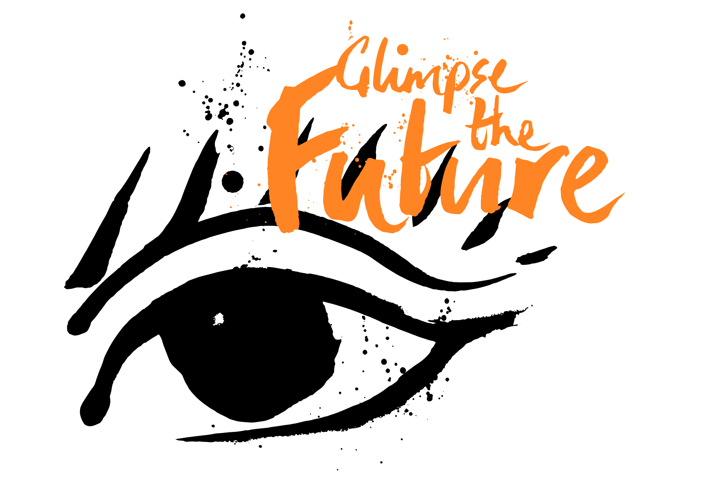
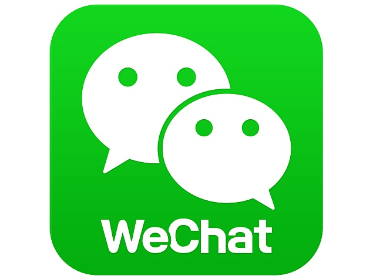

name: dblue
class: bg-dark-blue, center, middle
layout: true

<span class="twitter_id">@leggetter</span>

---

name: pink
layout: true

class: bg-pink, center, middle

<span class="twitter_id">@leggetter</span>

---

name: green
class: green-template, center, middle
layout: true

<span class="twitter_id">@leggetter</span>

---

name: lblue
layout: true
class: bg-light, center, middle

<span class="twitter_id">@leggetter</span>

---

name: white
layout: true
class: bg-white, center, middle, black-text

<span class="twitter_id">@leggetter</span>

---

template: white
class: title

<div style="float: left; width: 50%">
  <h1>The Past, Present and Future of Real-Time Apps & Communications</h1>
  <h2>FOWA Boston 2015</h2>
</div>



???

* FOWA LDN -> BOS

---

template: pink
class: top

# Real-Time FOWA

--
.left[
## 5 talks on Real-Time
]
--
.left[
## 4 talks on IoT
]
--
.center[
## 21 talks at FOWA 2105
]
--
.center[
## <span style="font-size: 1.5em; margin: 0;">Over 40%</span> talks on Real-Time
]

---

class: no-overlay
background-image: url(./img/realtime-revolution.jpg)

???

* Since 2001 -> trends
* Current surge
* Continued trend
* IoT? More to it
* Past, present & future
* Internet is our communications platform

---

template: lblue
class: title

* <span class="speaker">Phil @leggetter</span>
* <span class="speaker-job-title">Head of Developer Relations</span>
* <span class="speaker-pusher-logo"></span>

???

* Real-time since 2001
* SDKs
* Apps
* Evangelism

---

template: white
class: bg-contain
background-image: url(./img/pusher-white-cloud.png)

???

---

## Realtime Web Apps (Past)

> The World Wide Web (www) is an information space where documents and other web resources are identified by URLs, interlinked by hypertext links, and can be accessed via the Internet

---

## Realtime Web Apps

--

## &#8595;
## **s/Web/Internet**
--

## &#8595;
## Realtime Internet Apps

???

* Beyond web pages and Browsers
* Beyond just HTTP and hyperlinks

---

template: dblue

# When do we need Realtime?

---

## Data

### Is there a timely nature to the data?

???
- Is there a value or need to get the data quickly?
- Firm or Soft deadline
- Maintain Context ??

---

## User Experience

Is there a timely nature to the experience?

???
- Anything with human-to-human interaction
- Some interactions with systems
- Frustration at high latency on a voice call

---

template: pink
class: fixed-width-list

## Realtime is required when there's a *Need* or *Demand* for:

* Up to date information
* Interaction to maintain engagement (UX)

---

class: top

<br /><br />

# These aren't new *Needs* or *Demands*

## But...

--

# The Internet

???

But we had a constraint... The Internet

---

background-image: url(img/internet.png)
class: bg-contain

???
* long strived to build real-time Internet applications
* Arrow -> Effort required to innovate

---

background-image: url(img/plato-talkomatic.png)
class: bg-contain

???
Talkomatic realtime Chat - created back in 1973

---

background-image: url(img/internet-http.png)

???

---

## HTTP was better. But many wanted more.

---

background-image: url(img/yahoo-chat.png)

???
Yahoo! Web chat. Looks like a Java Applet.

---

background-image:url(img/reuters-kobra.png)
class: bg-contain

???
Financial Data. Also Java.

---

background-image: url(img/legacy-finance-web.gif)
class: bg-contain

---

class: fixed-width-list

## HTTP wasn't enough!

* HTTP - request/response paradigm
* Keeping persistent HTTP connections alive
* No cross-browser `XMLHttpRequest`
* 2 connection limit
* No browser cross origin support
* General cross browser incompatibilities

???

With the browser ...
Don't go into detail

---

class: fixed-width-list

## Hacks & Tricks

* Java Applets
* Flash
* HTTP Hacks

???

* So we hacked!
* And we continued to hack for years!

---

template: dblue

# Then Real-Time Went Mainstream

???

---

background-image: url(img/follow-magnified.png)
class: trans-h, top

# Social

???
Social Demonstrated Value:
- Twitter
- Facebook
- Skype
- Other chat solutions

- Demand and Need for update to date info
- Demand and Need for interaction

- The FOLLOW & FRIEND buttons - we know who's interested.

---

class: fixed-width-list

## Technology Advancements

* Memory & CPU speed and cost
* The cloud
* Browser standardisation & enhancements
* Any client can use the standards

???

---

class: bg-contain
background-image:url(img/internet-http-es-ws.png)

???

Close to innovation

---

## **MASSIVE** Increase in Internet Usage

---

class: unstyled-links top fixed-width-list

## Internet Usage (per day)

* **[200 billion emails][email-stat]**
--

* [7 million blog posts written][wordpress-stat]<sup>†</sup>
* **[500 million tweets][twitter-stat]**
--

* [55 million Facebook status updates][facebook-stat]
* [5 billion Google+ +1's][googleplus-stat]
* [60 million Instagram photos posted][instagram-stat]
* [2 billion minutes spent on Skype][skype-stat]
* [33 million hours of Netflix watched][netflix-stat]
* **[200 million hours of YouTube watched](youtube-stat)**

[email-stat]:http://www.radicati.com/wp/wp-content/uploads/2013/04/Email-Statistics-Report-2013-2017-Executive-Summary.pdf
[twitter-stat]:http://abcnews.go.com/Business/twitter-ipo-filing-reveals-500-million-tweets-day/story?id=20460493
[facebook-stat]:http://blog.kissmetrics.com/facebook-statistics/
[googleplus-stat]:http://www.mediabistro.com/alltwitter/social-media-stats-2012_b30651
[wordpress-stat]:http://wordpress.com/stats/posting/
[instagram-stat]:http://instagram.com/press/
[youtube-stat]:http://www.youtube.com/yt/press/statistics.html
[netflix-stat]:http://blog.netflix.com/2014/01/new-isp-performance-data-for-december.html
[skype-stat]:http://blogs.skype.com/2013/04/03/thanks-for-making-skype-a-part-of-your-daily-lives-2-billion-minutes-a-day/

???
- What are the main (work safe) uses for the Internet each day?
- † 41.5 million posts in April = 1.38 million per day. Assuming WordPress.com have 20% of the market; 1.38 * 5 = 6.9 million posts on all blogging platforms.

---

class: bg-white
background-image: url(./img/time-on-internet.png)

???

Mary Meeker, Kliener Perkins, Internet Trends 2015

---

template: dblue

# Realtime Apps in 2015

???
We're in a great position to be able to innovate.
So what's being built and with what?

---

class: top padding-center-fix fixed-width-list

# Realtime Apps in 2015 (Present)

* Real-time Use Cases

???

* Look at comms pattern
* Which use case they're best suited to

--
* Application Communication Patterns

???

* ways that clients and servers can communicate / real-time frameworks
* 5 different patterns

---

# Signalling

???

* Basic things
* Simple message or even no payload

---

class: full-video top trans-h

<h1 style="position: relative; z-index: 1000000;">Internet ^5 Machine</h1>

<video  poster="./video/internet-high-5-machine.png" width="90%" preload="none" controls>
  <!-- .element: class="fragment fade-in" data-fragment-index="1" -->
  <source src="./video/640/internet-high-5-machine-640.mp4" type="video/mp4">
  <source src="./video/640/internet-high-5-machine-640.webm" type="video/webm">
  <p>Please download and watch our <a href="./video/640/internet-high-5-machine-640.mp4">Internet ^5 clip</a></p>
</video>

???
Russell Thomas and Syd Lawrence

---

class: trans-h h-non-block

background-image: url(./img/talky-io.png)

## talky.io

???
- Uses WebRTC for audio & video
- Needs a signal to help the two peers know about each other

---

## Communication Pattern:
### Simple Messaging

???

* connection over which you can send a data payload

---

class: code-reveal top

Client

```js
var ws = new WebSocket('ws://localhost/');
```
--
```js
ws.onmessage = function(evt) {
  var data = JSON.parse(evt.data);
```
--
```js
  if(data.action) {
    // ^5  
  }
```
--
```js
  else if(data.peerId) {
    var connectTo = data.peerId;
  }
};
```
--

Server

```js
// server
server.on('connection', function(socket){
```
--
```js
  socket.send(JSON.stringify({action: 'high-5'}));
});
```

???

* Simplistic pattern
* Similar to WebHooks

---

background-image: url(./img/internet-http-es-ws-msg.png)

---

class: bg-contain trans-h bottom
background-image: url(./img/itv-news-nov-2015.gif)

# Notifications

???

Topic targeted notifications


---

## Communication Pattern:
### Publish-Subscribe (PubSub)

???

* messaging pattern
* Most common communication pattern in real-time frameworks

---

class: top code-reveal larger-code

Client

```js
var client = new Client('http://localhost:8000/');
```
--
```js
client.subscribe('news', function(data) {
```
--
```js
  console.log(data.headline);
});
```
--
Server

```js
server.publish('news', {headline: 'Pusher Rocks!'});
```

---

background-image: url(./img/internet-http-es-ws-msg-pubsub.png)

---

class: bg-cover, em-text, trans-h, bottom
background-image: url(./img/delighted-app.gif)

# Activity Streams

???

* a stream of activity
* things have - and are - happening
* synonymous with social apps
  * Twitter
  * Facebook
  * Google+
  * News
  * Sports
  
---

## Communication Pattern
### Evented PubSub

???

* An improvement on PubSub
* Used all all use cases PubSub can
* That lends itself to the real-time "evented" web

---

class: long wide code-reveal top

Client

```js
var pusher = new Pusher(APP_KEY);
var channel = pusher.subscribe('status');
```
--
```js
channel.bind('created', function(data) {
  // Add activity to UI
});
```
--
```js
channel.bind('updated', function(data) {
  // Update activity
});
channel.bind('deleted', function(data) {
  // Remove activity
});
```
--

Server

```js
pusher.trigger('status', 'created', {text: 'PubSub Rocks!', id: 1});
```
--
```js
pusher.trigger('status', 'updated', {text: 'Evented PubSub Rocks!', id: 1});
pusher.trigger('status', 'deleted', {id: 1});
```

---

class: em-text, trans-h, bg-contain
background-image: url(./img/lequipe-football.png)

# Data Visualizations

???

* Complex data partitioning
* Mapping to data on the back-end
* Or regions in the UI

---

class: bg-contain
background-image: url(./img/lequipe-football-regions.png)

???

* match overview 
* timeline events
* overview stats
* team lineup
* each tab in the UI
* PubSub or Evented PubSub
* Argue Evented PubSub is a better fit

---

class: bg-video, bg-cover, trans-h, em-text, bottom

# Chat

<video id="video" autoplay="true" loop="true">
  <source src="./img/pie.webm" type="video/webm">
  <source src="./img/pie.mp4" type="video/mp4">
</video>

???

* The 101 of realtime
* An interactive experience
* Real-time matters

---

class: bg-white
background-image: url(./img/messaging-apps.png)

---

## PubSub vs. Evented PubSub

???

* Let's use Chat to compare PubSub & Evented PubSub

---

class: bg-contain
background-image: url(./img/slack-ui.png)

---

class: bg-contain
background-image: url(./img/slack-ui-channels.png)

---

class: long larger-code top code-reveal

PubSub

```js
client.subscribe('devexp-channel', function(data) {
  if(data.eventType === 'chat-message') {
    addMessage(data.message);
  }
```
--
```js
  else if(data.eventType === 'channel-purposed-changed') {
    updateRoomTitle(data.purpose);
  }
  else if(/* and so on */) {
  }
})
```

--

Evented PubSub

```js
var channel = pusher.subscribe('devexp-channel');
channel.bind('chat-message', addMessage);
channel.bind('channel-purposed-changed', updateChannelPurpose);
```
--
```js
channel.bind('current-topic-changed', updateChannelTopic);
channel.bind('user-online', userOnline);
channel.bind('user-offline', userOffline);
```

---

background-image: url(./img/internet-http-es-ws-msg-pubsub-evented.png)

---

template: dblue
class: trans-h, bg-cover, bottom
background-image: url(./img/uber.jpg)

# Real-Time Location Tracking

---

template: lblue
class: trans-h, bottom
background-image: url(./img/atom-pair.gif)

# Multi-User Collaboration

???

* Google Apps
* Cloud 9
* TODO: other

---

class: bg-contain

background-image: url(./img/gdocs-collaboration.png)

???

* Word v GDocs workflow

---

class: bg-cover, trans-h, bg-white
background-image: url(./img/lunar-landing.png)

<h3 style="position: absolute; top: 2%; right: 2%; display: inline-block";>
  Multiplayer Games / Art
</h3>

---

## Communication Pattern
### Data Synchronisation (DataSync)

---

class: code-reveal top larger-code

Client

```js
var sync = new DataSync();

var ref = sync.get('document-1');
```
--
```js

ref.on(function(val) {
  console.log(val)
});
```
--

```js
ref.put({text: 'Hello, DataSync!'}).key('unique-key');
```
--

```js

ref.path('unique-key').set(null);
```
--

Framework handles updates to other clients

---

background-image: url(./img/internet-http-es-ws-msg-pubsub-ds.png)

???

Built on top of PubSub/Evented PubSub

???

---

## Communication Pattern
### RPC/RMI

Use Cases?

???

I'll use the term "RMI"

---

background-image: url(img/fx-motif.png)

???
- Open a trade
- Get open ack
- Wait for it to become executable
- You can withdraw/it can expire, or you can execute
- Trade is then confirmed
- Confirm ack / expired
- Easier to be calling methods on objects? RMI
- What is RMI?
- *This actually uses a PubSub framework**

---

class: top code-reveal long

Client

```js
rmi({
```
--
```js
  newMessage: function(message) {
    console.log(message);
  }
})
```
--
```js
.on('remote', function(remote) {
```
--
```js
  remote.sendMessage({text: 'dnode baby!'});
});
```
--

Server

```js
var remotes = [];
rmi({
  sendMessage: function(message) {
```
--
```js
    remotes.forEach(function(remote) {
      remote.newMessage(message);
    });
  }
})
```
--
```js
.on('remote', function(remote) {
  remotes.push(remote);
});
```

---

background-image: url(./img/internet-http-es-ws-msg-pubsub-ds-rmi.png)

---

## Choosing a Communication Pattern

---

class: trans-h
background-image: url(./img/rtw-tech-decision-matrix-black.png)

<h3 style="position: absolute; bottom: -2%; left: 0; display: inline;">Communication Patterns</h3>

---

class: trans-h

background-image: url(./img/rtw-tech-decision-matrix-usecases-black.png)

<h3 style="position: absolute; bottom: -2%; left: 0; display: inline;">Communication Patterns & Use Cases</h3>

---

template: pink
class: top

# Real-Time is Essential

--

<br />


???

Whether it's...

---

> I'm not sure I believe that there is such a thing as "realtime apps" any more. Apps either update instantly and smoothly, or they appear broken. I feel that "realtime" as a feature has moved down the Kano graph. It is much more of an expectation, than an "exciter".

Max Williams (@maxthelion) - CEO, Pusher

???

One step further

---

class: bg-contain bg-white
background-image: url(./img/kano-model.png)

---

template: pink
class: top fixed-width-list

## The Internet...
--

## 1. is our main **communications platform**
--

## 2. is becoming our main **entertainment platform**
--

## 3. should give users **real-time experiences**

---

template: dblue

# Future

---

class: fixed-width-list

## Network Infrastructure & Protocols

* Reliability
* Speed
* Beyond HTTP
* HTTP2

---

## Communication Pattern Protocol Standardisation

.left[
* [Bayeux](http://svn.cometd.org/trunk/bayeux/bayeux.html)
* [DDP](https://www.meteor.com/ddp)
* [dNode](https://github.com/substack/dnode-protocol)
* [EPCP](https://fanout.io/docs/protocols.html#extensible-pubsub-control-protocol-epcp)
* [GRIP](https://fanout.io/docs/protocols.html#generic-realtime-intermediary-protocol-grip)
* [MQTT](http://docs.oasis-open.org/mqtt/mqtt/v3.1.1/os/mqtt-v3.1.1-os.html)
]
.right[
* [Pusher Protocol](https://pusher.com/docs/pusher_protocol)
* [STOMP](https://stomp.github.io/stomp-specification-1.2.html)
* SignalR Protocol
* [WAMP](http://wamp.ws/) <small>(Web App Messaging Protocol)</small>
* XMPP ([various](http://xmpp.org/xmpp-protocols/rfcs/))
]

???

* The transportation layer is nearly solved

---

background-image: url(./img/internet-http-es-ws-msg-protocols-pubsub-rmi-ds.png)

---

## Real-Time APIs

.left[
* Campaign Monitor
* GitHub
* Iron.io
* MailChimp
]
.right[
* MailJet
* PagerDuty
* SendGrid
* Twilio
]
  
???

* API-focused companies already do this
* Enables expected real-time experiences

---

class: bg-white
background-image: url(./img/apps-with-realtime-apis.png)

???

Apps with real-time APIs

---

class: trans-h
background-image: url(./img/iot-2020.png)

<h2 style="position: absolute; top: 0; right: 0; display: inline;">More "Things"!</h2>

???
- IDC report
- Same report: 7.7 Billion people
- What connected?
- Homes, cars, kids, drones

---

## Smart Homes

---

class: full-video bottom trans-h

<video  poster="./video/gangnam-thumb.png" width="90%" preload="none" controls muted>
  <source src="./video/640/gangnam-node-640.mp4" type="video/mp4">
  <source src="./video/640/gangnam-node-640.webm" type="video/webm">
  <p>Please download and watch our <a href="./video/640gangnam-node-640.mp4">Gangnam Nodecopter Clip</a></p>
</video>

## Drones

???

* Amazon and Walmart are all experimenting
* Google plans drone delivery service for 2017

---

class: trans-h top
background-image:url(./img/autonomous-cars.jpg)

## Autonomous Cars

---

class: trans-h bg-cover bottom
background-image: url(./img/the-physical-web.png)

<h2 style="position: absolute; right: 1%; display: inline-block;">
  <a style="color:white; text-decoration:none;" href="https://www.youtube.com/watch?v=1yaLPRgtlR0&feature=youtu.be">The Physical Web</a>
</h2>

---

template:dblue

# IoT, Apps & Developers

---

template: pink
class: top fixed-width-list

## A **thing** can be any**thing**

--

* Sensors
* Appliances
* Vehicles
* Smart Phones
* Devices (Arduino, Electric Imp, Raspberry Pi etc.)
--

* Servers
* Browsers
* Apps: Native, Web, running anywhere

---

class: fixed-width-list

## The Majority of code we'll write will still be for "Apps"

* Configuring
* Monitoring
* Interacting
* App Logic

---

class: top fixed-width-list

## Real-Time Use Case Evolution

* Notifications & Signalling
* Activity Streams
* Data Viz & Polls
* Chat
* Collaboration
* Multiplayer Games

???

* The use case for real-time have stayed the same for the past 5 years
* The use cases will fundamentally remain the same, but will augment

---

class: trans-h bg-contain bg-white top h-abs-top
background-image: url(./img/notifications-actions.png)

## Notifications/Activity Streams -> Actions

<a style="position: absolute; bottom: 5%; z-index: 100000; color: black" href="https://blog.intercom.io/the-end-of-apps-as-we-know-them/">The end of apps as we know it - Intercom</a>

---

class: bg-white trans-h top bg-contain
background-image: url(./img/google-now-subscriptions.jpg)

## Subscriptions

---

class: bg-white trans-h top
background-image: url(./img/google-now.jpg)

## Personalised Event Streams

---
class: bg-white trans-h top bg-contain
background-image: url(./img/unified-uis.png)

## Unified UIs

---

template: dblue

# Chat for Everything

---

## WeChat



.right[
* 549M MAUs
* 10k integrations
* app-within-an-app model
* taxi, order food, tickets, games etc.
]

???

* We all use chat
* Skype, HipChat, Slack and Google Hangouts

---

class: trans-h bottom
background-image: url(./img/slack-integration.png)

## Chat Integrations

---

## Chat "Virtual Assistants"

.left[
* Siri
* Google Now
]
.right[
* Microsoft Cortana
* Facebook M
]

---

template: pink

# Chat has evolved. Chat is now a platform!

---

# Multi-Device Experiences

???
Multiple devices involved in the same experience

---

class: full-video

<iframe width="100%" height="80%" src="https://www.youtube.com/embed/1mkShXn_buA?start=1500" frameborder="0" allowfullscreen></iframe>

???
- We confine ourselves to thinking in the singular.
- What if we think in multiples?
- What sort of experiences and uses would that result in?

---

class: top fixed-width-list

# Summary
--

* The Internet is our communications platform
--

* Easier than ever to innovate on this platform
--

* Users expect real-time experiences
--

* Future:
  * Infrastructure
  * standards
  * IoT
  * Event streams
  * Use case evolution
  * Chat everywhere
  
---

class: fixed-width-list

## Realtime Internet Apps === IoT
* Web Browsers +
* Web Servers +
* Native Apps +
* Devices +
* ...

---

template: dblue
class: title

# The Past, Present and Future of Real-Time Apps & Communications

Thanks! Feedback & Questions!

* <span class="speaker">Phil @leggetter</span>
* <span class="speaker-job-title">Head of Evangelism</span>
* <span class="speaker-pusher-logo"></span>

???

My name's...
I hope that we can help you be part of a future of real-time internet apps

---

## References 

* [Pusher](https://pusher.com)
* [These slides - leggetter.github.io/realtime-internet-apps/](http://leggetter.github.io/realtime-internet-apps/)
* [Mary Meeker's internet trend report](file:///Users/leggetter/Downloads/Internet_Trends_2015_v3.pdf)
* [Kano model](https://en.wikipedia.org/wiki/Kano_model)
* [DDP Protocol](https://www.meteor.com/ddp)
* [Socket.IO protocol](https://github.com/socketio/socket.io-protocol)
* [MQTT](http://mqtt.org/)
* [Real-Time Web Tech Guide](www.leggetter.co.uk/real-time-web-technologies-guide/)
* [The end of apps as we know them - Intercom](https://blog.intercom.io/the-end-of-apps-as-we-know-them/)
