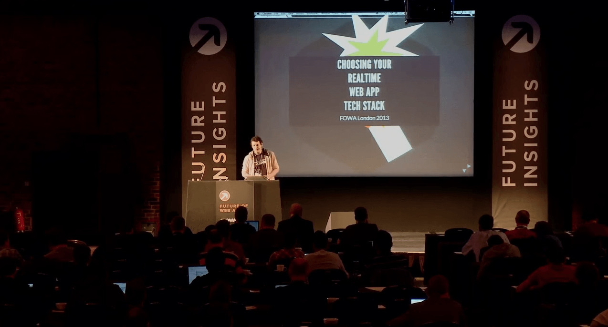

name: dblue
layout: true

class: bg-dark, center, middle

---

name: lblue
layout: true

class: bg-light, center, middle

---

class: title

# Real-Time Web Apps in 2015 & Beyond

* <span class="speaker">Phil @leggetter</span>
* <span class="speaker-job-title">Head of Evangelism</span>
* <span class="speaker-pusher-logo"></span>

???

---

template: dblue
class: bg-contain, pusher-circle
background-image: url(./img/pusher-circles.png)

---

## Realtime Web Apps
--

## &#8595;
## **s/Web/Internet**
--

## &#8595;
## Realtime Internet Apps

???

---

template: lblue
class: h1-big

# Realtime

???

---

class: bg-cover, em-text
background-image: url(./img/warp-core.gif)

# Hard Realtime

---

class: bg-cover
background-image: url(./img/core-breach.gif)

???

Maybe the Enterprise used SignalR to manage its
warp core safety system?

---

template: dblue
class: bg-contain, em-text, middle, center
background-image: url(./img/soft-realtime.gif)

# Soft Realtime

???

* It's still really fast
* Business critical: have safty fallbacks

---

template: lblue

# When do we need Realtime?

---

## Data

Is there a timely nature to the data?

???
- Is there a value or need to get the data quickly?
- Does it need to maintain in-context?
- Hashtags can indicate context after the event.

---

<!-- background-image: url(img/excited-data.gif) -->
<!-- class: em-text -->

## You Have Real-Time Data

### Events == Real-Time Data

* Data Changes
* System Interactions
* User Interactions

???

The real-time web is sometimes referred to as the "Evented Web"

---

## User Experience

Is there a timely nature to the experience?

???
- Anything with human-to-human interaction
- Some interactions with systems
- Frustration at high latency on a voice call

---

## Realtime is required when there's a *Need* or *Demand* for:

* Up to date information
* Interaction to maintain engagement (UX)

---

# These aren't new *Needs* or *Demands*

## But...

???

But we had a constraint... The Internet

---

# Internet

---

background-image: url(img/internet.png)
class: bg-contain

???
Like any technology basics of the Internet don't give us enough to work with.

---

background-image: url(img/internet-http.png)

???

---

## HTTP was better. But many wanted more.

---

background-image: url(img/plato-talkomatic.png)
template: dblue
class: bg-contain

???
Talkomatic realtime Chat - created back in 1973

---

template: dblue
background-image: url(img/yahoo-chat.png)

???
Yahoo! Web chat. Looks like a Java Applet.

---

template: dblue
background-image:url(img/reuters-kobra.png)
class: bg-contain

???
Financial Data. Also Java.

---

template: dblue
background-image: url(img/legacy-finance-web.gif)
class: bg-contain

---

## HTTP wasn't enough!

* HTTP - request/response paradigm
* Keeping persistent HTTP connections alive
* No cross-browser `XMLHttpRequest`
* 2 connection limit
* No browser cross origin support
* General cross browser incompatibilities

---

## Hacks & Tricks

* Java Applets
* Flash
* HTTP Hacks

---

# 5 Things that have made Real-Time Mainstream?

???

---

template: dblue
background-image: url(img/follow-magnified.png)
class: trans-all, top

# 1. Social

???
Social Demonstrated Value:
- Twitter
- Facebook
- Skype
- Other chat solutions

- Demand and Need for update to date info
- Demand and Need for interaction

- The FOLLOW & FRIEND buttons - we know who's interested.

---

## 2. Improved Server Power

* Processors and Memory are cheaper & faster
* More data can be processes
* Connections can be dealt with
* Scaling is easier

---

## 3. Web Browser Capabilities and Consistency

* Cross browser `XMLHTTPRequest` support
* CORS
* Server Sent Events / EventSource
* WebSocket
* WebRTC

???
Cross browser "Hacks"

---

class: bg-contain
background-image:url(img/internet-http-es-ws.png)

---

# Any Client Technology

???
Protocol + API specs = Any tech can implement.

background-image: url(img/connection-strategies.png)

???
A note on connection strategies with these technologies

---

## 4. Software Choice

* Lots of language & runtime options
* More open source solutions
* Hosted services

---

## 5. **MASSIVE** Increase in Internet Usage

## Many of them with a real-time focus!

---

class: unstyled-links top fixed-width-list

## Internet Usage (per day)

* **[200 billion emails][email-stat]**
--

* [7 million blog posts written][wordpress-stat]<sup>†</sup>
* **[500 million tweets][twitter-stat]**
--

* [55 million Facebook status updates][facebook-stat]
* [5 billion Google+ +1's][googleplus-stat]
* [60 million Instagram photos posted][instagram-stat]
* [2 billion minutes spent on Skype][skype-stat]
* [33 million hours of Netflix watched][netflix-stat]
* **[200 million hours of YouTube watched](youtube-stat)**

[email-stat]:http://www.radicati.com/wp/wp-content/uploads/2013/04/Email-Statistics-Report-2013-2017-Executive-Summary.pdf
[twitter-stat]:http://abcnews.go.com/Business/twitter-ipo-filing-reveals-500-million-tweets-day/story?id=20460493
[facebook-stat]:http://blog.kissmetrics.com/facebook-statistics/
[googleplus-stat]:http://www.mediabistro.com/alltwitter/social-media-stats-2012_b30651
[wordpress-stat]:http://wordpress.com/stats/posting/
[instagram-stat]:http://instagram.com/press/
[youtube-stat]:http://www.youtube.com/yt/press/statistics.html
[netflix-stat]:http://blog.netflix.com/2014/01/new-isp-performance-data-for-december.html
[skype-stat]:http://blogs.skype.com/2013/04/03/thanks-for-making-skype-a-part-of-your-daily-lives-2-billion-minutes-a-day/

???
- What are the main (work safe) uses for the Internet each day?
- † 41.5 million posts in April = 1.38 million per day. Assuming WordPress.com have 20% of the market; 1.38 * 5 = 6.9 million posts on all blogging platforms.

---

Add Mary Meeker slides

---

Specific well know app examples e.g. Twitter, Facebook Messenger, Uber & Google Docs

---

Quote from Max Williams of Pusher

---

# Real-Time is Essential because...

---

template: dblue
class: trans-all bg-cover bg-fade top fixed-width-list
background-image: url(img/internet-communications.jpg)

## The Internet...
--

1. **is *the* communications platform**
--

2. **is becoming *the* entertainment platform**

---

# Realtime Apps in 2015

???
In a great place to be able to innovate.
So what's being built and with what?
This is software - these are my opinions. You can achieve similar things in different ways.

---

class: top trans-h
background-image: url(./img/itv-news-may-2014.png)

# Notifications & Signalling

---

class: full-video top trans-h

<h1 style="position: relative; z-index: 1000000;">Internet ^5 Machine</h1>

<video  poster="./video/internet-high-5-machine.png" width="90%" preload="none" controls>
  <!-- .element: class="fragment fade-in" data-fragment-index="1" -->
  <source src="./video/640/internet-high-5-machine-640.mp4" type="video/mp4">
  <source src="./video/640/internet-high-5-machine-640.webm" type="video/webm">
  <p>Please download and watch our <a href="./video/640/internet-high-5-machine-640.mp4">Internet ^5 clip</a></p>
</video>

???
Russell Thomas and Syd Lawrence

---

class: trans-h h-non-block

background-image: url(./img/talky-io.png)

## talky.io

???
- Uses WebRTC for audio & video
- Needs a signal to help the two peers know about each other

---

**Receive message**

```js
var socket = new eio.Socket('ws://localhost/');
socket.on('open', function(){
  socket.on('message', function(data){
    console.log(data);
  });
});
```

**Send Message**

```js
var engine = require('engine.io');
var server = engine.listen(80);

server.on('connection', function(socket){
  socket.send('utf 8 string');
  socket.send(new Buffer([0, 1, 2, 3, 4, 5])); // binary data
})
```

---

## Simple Messaging Solutions

.col-3rd[* Server/Server
  * WebHooks]
  
.col-3rd[* Client/Server
  * [SockJS](https://github.com/sockjs)
  * [Engine.IO](https://github.com/automattic/engine.io)
  * [Primus](https://github.com/primus/primus)]
  
.col-3rd[* Peer-to-Peer
  * [simpleWebRTC](http://simplewebrtc.com/)
  * [PeerJS](http://peerjs.com/)]

???
* Not too many to choose from
* For client/server you generally need a higher abstraction.

---

background-image: url(./img/internet-http-es-ws-msg.png)

---

# Complex Data

---

background-image: url(./img/mancity-match-day-centre.png)

???
- Manchester City Match Day Centre
- Identify and get the specific pieces of information that it needs

---

background-image: url(./img/mancity-match-day-centre-pubsub.png)

???
- Overview data about the score, scorers, location and time played
- Timeline information about key events
- Activity Streams
- An overview of the status of the starting 11 players
- PubSub: channels/topics/subjects

---

<video  poster="video/trader2.png" width="90%" preload="none" controls>
  <source src="video/trader2.mp4" type="video/mp4">
  <source src="video/trader2.webm" type="video/webm">
</video>

???
- Subscribe to what's visible
- Sub/Unsub as required

---

class: long

## PubSub

**Subscribe**

```js
var client = new Faye.Client('http://localhost:8000/');

client.subscribe('/messages', function(message) {
  alert('Got a message: ' + message.text);
});
```

**Publish**

```js
client.publish('/messages', {text: 'Hello world'});
```

---

class: long

## Evented PubSub

**Subscribe**

```js
var pusher = new Pusher( APP_KEY );
var channel = pusher.subscribe( 'messages' );

channel.bind( 'new_message', function( data ) {
  // Handle Update
} );

channel.bind( 'message_updated', function( data ) {
} );
```

**Publish**

```js
var data = {text: 'Hello world'};
pusher.trigger( 'messages', 'new_message', data );
```

???
In many ways Socket.IO is also an evented PubSub solution.
With events first and then also offering namespaces and rooms.

---

## PubSub Solutions

.left[
* Self Hosted
  * [Socket.IO](http://socket.io) <sup>†</sup>
  * [Faye](http://faye.jcoglan.com)
  * [XSockets](http://xsockets.net) <sup>†</sup>
]

.right[
* Hosted
  * [Hydna](http://hydna.com)
  * [PubNub](http://pubnub.com)
  * [Pusher](http://pusher.com) <sup>†</sup>
  * [Realtime.co](http://realtime.co)
]

<small style="position: absolute; bottom: 5%;">† Evented PubSub solutions</small>

---

background-image: url(./img/internet-http-es-ws-msg-pubsub.png)

---

# Complex Client/Server Interactions

???
- You can use PubSub for this
- CT - initially just displaying data - now interactive.
- Complex client/server business workflows

---

background-image: url(img/fx-motif.png)

???
- Open a trade
- Get open ack
- Wait for it to become executable
- You can withdraw/it can expire, or you can execute
- Trade is then confirmed
- Confirm ack / expired
- Easier to be calling methods on objects? RMI
- What is RMI?

---

background-image: url(img/shooter.png)

???
- Game state authority
- Complex rich symantic interactions
- May be better suited to RMI?

---

**Server**

```js
public class GameHub : Hub {
    public void Move(Player p, int x, int y) {
      // Check if move is allowed
      // Call the broadcastMessage method to update clients.
      Clients.All.playerMoved(p, x, y);
    }
}
```

**Client**

```
$.connection.hub.start(); // async

var game = $.connection.gameHub;

game.client.playerMoved = function (player, x, y) {
  // update game
};

game.server.move( me, x, y );
```

---

## RMI Solutions

.left[* Self Hosted:
  * [dNode](https://github.com/substack/dnode) <small>(Node, PHP, Java, Ruby, Perl)</small>
  * [eureca.io](https://github.com/Ezelia/eureca.io) <small>(Node)</small>
  * [Java.rmi](http://docs.oracle.com/javase/7/docs/api/java/rmi/package-summary.html)
  * [Meteor](https://www.meteor.com/) <small>(Node)</small>
  * [SignalR](http://www.asp.net/signalr) <small>(.NET)</small>
  * [XSockets](http://xsockets.net) <small>(.NET)</small>]
.right[* Hosted:
  * *SignalR on Windows Azure?*]

---

background-image: url(./img/internet-http-es-ws-msg-pubsub-rmi.png)

---

# Collaborating on Data

---

background-image: url(./img/gdocs-collaboration.png)

???
- Any use case where you're working on a data structure
- Agile PM boards is common use case
- Online Code Editors

---

background-image: url(./img/collaborative-mapping.png)

---

class: bottom trans-h full-video

<h1 style="position: relative; z-index: 1000000;">Physical Collaborative Mapping</h1>

<video  poster="./video/physical-collaborative-mapping.png" width="90%" preload="none" controls>
  <source src="./video/640/physical-collaborative-mapping-640.mp4" type="video/mp4">
  <source src="./video/640/physical-collaborative-mapping-640.webm" type="video/webm">
</video>

???
- Large organisations are looking into creating realtime emergency centres

---

**DataSync**

```
var myDataRef = new Firebase('https://my-app.firebaseio.com/');

myDataRef.push( {creator: '@leggetter', text: 'Not a Test!'} );

myDataRef.on( 'child_added', function(snapshot) {
  // Add the data
});

myDataRef.on( 'child_changed', function(snapshot) {
  // Update the data
});

myDataRef.on( 'child_removed', function(snapshot) {
  // Remove the data
});
```

---

## Data Sync Solutions

.left[
* Self Hosted:
  * [CouchDB](http://couchdb.apache.org/) + [pouchdb](http://pouchdb.com/)
  * [DerbyJS](http://derbyjs.com/)
  * [LowlaDB](https://github.com/lowla)
  * [Meteor](http://meteor.com)
  * [ShareJS](https://github.com/share/ShareJS)
]
.right[* Hosted:
  * [Firebase](http://firebase.com)
  * [Flybase](http://flybase.io/)
  * [Google Drive Realtime API](https://developers.google.com/drive/realtime/)
  * [Realtime.co](http://realtime.co)
  * [Simperium](http://simperium.com)
  * [Syncano](http://syncano.com)
]

???

* Some are a bit more "all-in" than others
* e.g. Meteor & Derby offer templating

---

background-image: url(./img/internet-http-es-ws-msg-pubsub-rmi-ds.png)

???
It's now so much easier to innovate!

---

class: top

## How do you choose a solution?

--

### Watch my videos :)

<a href="https://www.youtube.com/watch?v=PUENh1Ym9E4"></a>

<a href="https://www.youtube.com/watch?v=VENVNimklWg"></a>

---

class: bottom-left-h trans-all bg-right
background-image: url(./img/connection-strategies.png)
background-position: right

### Connection Strategy

???

You've got to be able to establish a connection.

---

class: bottom-left-h trans-all
background-image: url(./img/rtw-tech-decision-matrix-white.png)

### Communication Pattern

---

background-image: url(./img/rtw-tech-decision-matrix-apps.png)

???
  
---

background-image: url(./img/rtw-tech-decision-matrix-solutions.png)

---

# Beyond

---

## Network Infrastructure

* Reliability
* Speed
* Beyond HTTP

---

# More "Things"!

---

template: dblue
background-image: url(./img/iot-2020.png)

???
- IDC report
- Same report: 7.7 Billion people
- What connected?
- Homes, cars, kids, drones

---

<video  poster="./video/gangnam-thumb.png" width="90%" preload="none" controls>
  <source src="./video/640/gangnam-node-640.mp4" type="video/mp4">
  <source src="./video/640/gangnam-node-640.webm" type="video/webm">
  <p>Please download and watch our <a href="./video/640gangnam-node-640.mp4">Gangnam Nodecopter Clip</a></p>
</video>

???
- Most common use case for IoT right now!
- BBC use drone for video.
- Lots of use in agriculture
- AR Drones controlled via UDP packets
- Generally accessed via a library abstraction

---

# And APIs...

---

* Use Realtime
  * Twilio
  * SendGrid
  * MailChimp
  * Iron.io
  * GitHub
  * Trello
  * ...
* APIs for APIs
  * Fanout.io

---

class: bg-white
background-image: url(./img/nest-thermostat.jpg)

???
- Nest acquired by Google for $3.2B

---

## IoT Platforms

* [SmartThings](http://www.smartthings.com/index.php)
* ~~[NinjaBlocks](http://ninjablocks.com/)~~
* [EvryThing](https://www.evrythng.com/)
* [SKYNET.im](http://skynet.im) -> [Octoblu](https://www.octoblu.com/)

---

# Multi-Device Experiences

???
Multiple devices involved in the same experience

---

background-image: url(./img/watch_dogs_ctos.jpg)
class: trans-all

## Watch_Dogs

???
- Not mentioned 2nd screen experiences.
- But this is more than that. This is true engagement.
- Tablets so popular. We'll see more of this.

---

<video  poster="./video/ben-foxall-multi-device-web-futurejs.png" width="90%" preload="none" controls>
  <source src="./video/640/ben-foxall-multi-device-web-futurejs-640.mp4" type="video/mp4">
  <source src="./video/640/ben-foxall-multi-device-web-futurejs-640.webm" type="video/webm">
</video>

???
- We confine ourselves to thinking in the singular.
- What if we think in multiples?
- What sort of experiences and uses would that result in?

---

# Realtime Internet Apps =
# Internet of Things =
### Web Browsers +
### Web Servers +
### Native Apps +
### Devices +

---

class: title

# Real-Time Web Apps in 2015 & Beyond

Thanks, Feedback & Questions!

* <span class="speaker">Phil @leggetter</span>
* <span class="speaker-job-title">Head of Evangelism</span>
* <span class="speaker-pusher-logo"></span>

???
