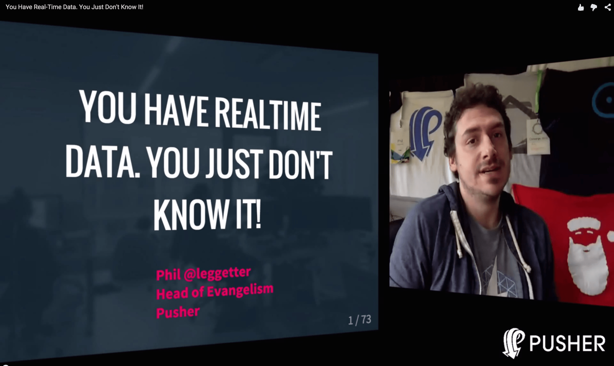
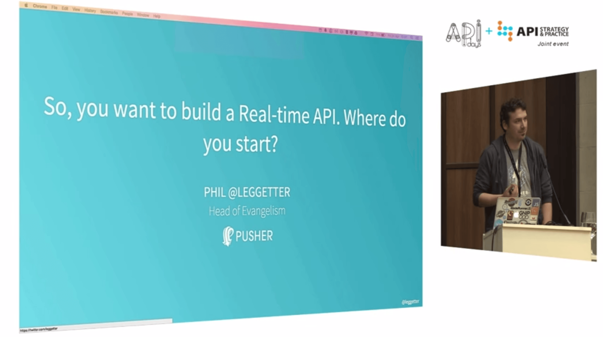

name: dblue
class: bg-dark-blue, center, middle
layout: true

<span class="twitter_id">@leggetter</span>

---

name: pink
layout: true

class: bg-pink, center, middle

<span class="twitter_id">@leggetter</span>

---

name: green
class: green-template, center, middle
layout: true

<span class="twitter_id">@leggetter</span>

---

name: lblue
layout: true
class: bg-light, center, middle

<span class="twitter_id">@leggetter</span>

---

name: white
layout: true
class: bg-white, center, middle, black-text

<span class="twitter_id">@leggetter</span>

---

template: white
class: title

<div style="float: left; width: 50%">
  <h1>Real-Time Web Apps in 2015 & Beyond</h1>
  <h2>FOWA Boston 2015</h2>
</div>


???

* Real-Time Web Apps in 2015 & Beyond
* FOWA LDN -> BOS

---

template: pink
class: top

# Real-Time FOWA

--
.left[
## 5 talks on Real-Time
]
--
.left[
## 4 talks on IoT
]
--
.center[
## 21 talks at FOWA 2105
]
--
.center[
## <span style="font-size: 1.5em; margin: 0;">Over 40%</span> talks on Real-Time
]

---

class: no-overlay
background-image: url(./img/realtime-revolution.jpg)

???

* Since 2001 -> trends
* Current surge
* Continued trend
* IoT? More to it
* Past, present & future
* Internet is our communications platform

---

template: lblue
class: title

* <span class="speaker">Phil @leggetter</span>
* <span class="speaker-job-title">Head of Developer Relations</span>
* <span class="speaker-pusher-logo"></span>

???

* Real-time since 2001
* SDKs
* Apps
* Evangelism

---

template: white
class: bg-contain
background-image: url(./img/pusher-white-cloud.png)

???

---

## Realtime Web Apps

> The World Wide Web (www) is an information space where documents and other web resources are identified by URLs, interlinked by hypertext links, and can be accessed via the Internet

---

## Realtime Web Apps

--

## &#8595;
## **s/Web/Internet**
--

## &#8595;
## Realtime Internet Apps

???

* Beyond web pages and Browsers
* Beyond just HTTP and hyperlinks

---

template: dblue
class: h1-big

# Realtime?

???

---

template: dblue
class: bg-cover, em-text
background-image: url(./img/warp-core.gif)

# Hard Realtime

---

template: dblue
class: bg-cover
background-image: url(./img/core-breach.gif)

???

Maybe the Enterprise used SignalR to manage its
warp core safety system?

---

template: dblue
class: bg-contain, em-text, middle, center
background-image: url(./img/soft-realtime.gif)

# Firm/Soft Realtime

???

* It's still really fast
* Business critical: have safty fallbacks

---

template: dblue

# When do we need Realtime?

---

## Data

### Is there a timely nature to the data?

???
- Is there a value or need to get the data quickly?
- Firm or Soft deadline
- Maintain Context ??

---

template: pink
class: fixed-width-list top

## You Have Real-Time Data

--

Any event in your web stack...

* Incoming Data
* Data Changes
* System Interactions
* User Interactions

... represents real-time data.

???

The real-time web is sometimes referred to as the "Evented Web"

---

class: full-image

<a href="https://www.youtube.com/watch?v=rk5Jm1IHxlI"></a>

---

## User Experience

Is there a timely nature to the experience?

???
- Anything with human-to-human interaction
- Some interactions with systems
- Frustration at high latency on a voice call

---

template: pink
class: fixed-width-list

## Realtime is required when there's a *Need* or *Demand* for:

* Up to date information
* Interaction to maintain engagement (UX)

---

class: top

<br /><br />

# These aren't new *Needs* or *Demands*

## But...

--

# The Internet

???

But we had a constraint... The Internet

---

background-image: url(img/internet.png)
class: bg-contain

???
* long strived to build real-time Internet applications
* Arrow -> Effort required to innovate

---

background-image: url(img/plato-talkomatic.png)
class: bg-contain

???
Talkomatic realtime Chat - created back in 1973

---

background-image: url(img/internet-http.png)

???

---

## HTTP was better. But many wanted more.

---

background-image: url(img/yahoo-chat.png)

???
Yahoo! Web chat. Looks like a Java Applet.

---

background-image:url(img/reuters-kobra.png)
class: bg-contain

???
Financial Data. Also Java.

---

background-image: url(img/legacy-finance-web.gif)
class: bg-contain

---

class: fixed-width-list

## HTTP wasn't enough!

* HTTP - request/response paradigm
* Keeping persistent HTTP connections alive
* No cross-browser `XMLHttpRequest`
* 2 connection limit
* No browser cross origin support
* General cross browser incompatibilities

---

class: fixed-width-list

## Hacks & Tricks

* Java Applets
* Flash
* HTTP Hacks

???

* So we hacked!
* And we continued to hack for years!

---

template: dblue

# 5 Things that have made Real-Time Mainstream

???

---

background-image: url(img/follow-magnified.png)
class: trans-h, top

# 1. Social

???
Social Demonstrated Value:
- Twitter
- Facebook
- Skype
- Other chat solutions

- Demand and Need for update to date info
- Demand and Need for interaction

- The FOLLOW & FRIEND buttons - we know who's interested.

---

class: fixed-width-list

## 2. Improved Server Power

* Processors and Memory are cheaper & faster
* More data can be processes
* Connections can be dealt with ([C10k problem](https://en.wikipedia.org/wiki/C10k_problem))
* Scaling is possible

---

class: fixed-width-list

## 3. Web Browser Capabilities and Consistency

* Cross browser `XMLHTTPRequest` support
* CORS
* Server Sent Events / EventSource
* WebSocket
* WebRTC

???
Cross browser "Hacks"

---

class: bg-contain
background-image:url(img/internet-http-es-ws.png)

--
class: trans-h bottom

# Any Client Technology

???
Protocol + API specs = Any tech can implement.

background-image: url(img/connection-strategies.png)

???
A note on connection strategies with these technologies

---

class: fixed-width-list

## 4. Software Choice

* Lots of language & runtime options
* More open source solutions
* "The cloud"/hosted services

???

* 2001 - only proprietary
* 2010 - this changed
* Lang/runtime choice

---

## 5. **MASSIVE** Increase in Internet Usage

---

class: unstyled-links top fixed-width-list

## Internet Usage (per day)

* **[200 billion emails][email-stat]**
--

* [7 million blog posts written][wordpress-stat]<sup>†</sup>
* **[500 million tweets][twitter-stat]**
--

* [55 million Facebook status updates][facebook-stat]
* [5 billion Google+ +1's][googleplus-stat]
* [60 million Instagram photos posted][instagram-stat]
* [2 billion minutes spent on Skype][skype-stat]
* [33 million hours of Netflix watched][netflix-stat]
* **[200 million hours of YouTube watched](youtube-stat)**

[email-stat]:http://www.radicati.com/wp/wp-content/uploads/2013/04/Email-Statistics-Report-2013-2017-Executive-Summary.pdf
[twitter-stat]:http://abcnews.go.com/Business/twitter-ipo-filing-reveals-500-million-tweets-day/story?id=20460493
[facebook-stat]:http://blog.kissmetrics.com/facebook-statistics/
[googleplus-stat]:http://www.mediabistro.com/alltwitter/social-media-stats-2012_b30651
[wordpress-stat]:http://wordpress.com/stats/posting/
[instagram-stat]:http://instagram.com/press/
[youtube-stat]:http://www.youtube.com/yt/press/statistics.html
[netflix-stat]:http://blog.netflix.com/2014/01/new-isp-performance-data-for-december.html
[skype-stat]:http://blogs.skype.com/2013/04/03/thanks-for-making-skype-a-part-of-your-daily-lives-2-billion-minutes-a-day/

???
- What are the main (work safe) uses for the Internet each day?
- † 41.5 million posts in April = 1.38 million per day. Assuming WordPress.com have 20% of the market; 1.38 * 5 = 6.9 million posts on all blogging platforms.

---

class: bg-white
background-image: url(./img/time-on-internet.png)

???

Mary Meeker, Kliener Perkins, Internet Trends 2015

---

class: bg-white
background-image: url(./img/messaging-apps.png)

---

template: pink
class: top

# Real-Time is Essential

--

<br />


???

Whether it's...

---

> I'm not sure I believe that there is such a thing as "realtime apps" any more. Apps either update instantly and smoothly, or they appear broken. I feel that "realtime" as a feature has moved down the Kano graph. It is much more of an expectation, than an "exciter".

Max Williams (@maxthelion) - CEO, Pusher

???

One step further

---

class: bg-contain bg-white
background-image: url(./img/kano-model.png)

---

template: pink
class: top fixed-width-list

## The Internet...
--

## 1. is our main **communications platform**
--

## 2. is becoming our main **entertainment platform**
--

## 3. should give users **real-time experiences**

---
template: dblue

# Realtime Apps in 2015

???
We're in a great position to be able to innovate.
So what's being built and with what?

---

class: top padding-center-fix fixed-width-list

# Realtime Apps in 2015

* Communication Patterns
???

* ways that clients and servers can communicate / real-time frameworks
* 5 different patterns

--

* Real-time use Cases

???

* Look at comms pattern
* Which use case they're best suited to

---

class: fixed-width-list

## Simple Messaging

???

* connection over which you can send a data payload

---

class: code-reveal top larger-code

Client

```js
var ws = WebSocket('ws://localhost/');
```
--
```js
ws.onmessage = function(evt) {
  console.log(evt.data);
};
```
--

Server

```js
// server
server.on('connection', function(socket){
```
--
```js
  socket.send('utf 8 string');
});
```

???

* Simplistic pattern
* Similar to WebHooks

---

background-image: url(./img/internet-http-es-ws-msg.png)

---

class: fixed-width-list

## Simple Messaging: Use cases

* Signalling

???

* Basic things
* Simple message or even no payload

---

class: full-video top trans-h

<h1 style="position: relative; z-index: 1000000;">Internet ^5 Machine</h1>

<video  poster="./video/internet-high-5-machine.png" width="90%" preload="none" controls>
  <!-- .element: class="fragment fade-in" data-fragment-index="1" -->
  <source src="./video/640/internet-high-5-machine-640.mp4" type="video/mp4">
  <source src="./video/640/internet-high-5-machine-640.webm" type="video/webm">
  <p>Please download and watch our <a href="./video/640/internet-high-5-machine-640.mp4">Internet ^5 clip</a></p>
</video>

???
Russell Thomas and Syd Lawrence

---

class: trans-h h-non-block

background-image: url(./img/talky-io.png)

## talky.io

???
- Uses WebRTC for audio & video
- Needs a signal to help the two peers know about each other

---

## Publish-Subscribe (PubSub)

???

* messaging pattern

---

class: top code-reveal larger-code

Client

```js
var client = new Client('http://localhost:8000/');
```
--
```js
client.subscribe('news', function(data) {
```
--
```js
  console.log(data.headline);
});
```
--
Server

```js
server.publish('news', {headline: 'Pusher Rocks!'});
```

---

background-image: url(./img/internet-http-es-ws-msg-pubsub.png)

---

class: fixed-width-list

## PubSub: Use Cases

* Signalling
* Notifications
* Activity streams
* Data visualisation
* Real-time geolocation
* Chat
* more...

???

Most common communication pattern in real-time frameworks

---

class: bg-contain
background-image: url(./img/itv-news-nov-2015.gif)

???

Topic targeted notifications

---

class: bg-contain
background-image: url(./img/lequipe-football.png)

???

* Complex data partitioning
* Mapping to data on the back-end
* Or regions in the UI

---

class: bg-contain
background-image: url(./img/lequipe-football-regions.png)

???

* match overview 
* timeline events
* overview stats
* team lineup
* each tab in the UI

---

# Evented PubSub

???

An improvement on PubSub
That lends itself to the real-time "evented" web

---

class: long wide code-reveal top

Client

```js
var pusher = new Pusher(APP_KEY);
var channel = pusher.subscribe('news');
```
--
```js
channel.bind('created', function(data) {
  // Add news to UI
});
```
--
```js
channel.bind('updated', function(data) {
  // Update news
});
channel.bind('deleted', function(data) {
  // Remove news
});
```
--

Server

```js
pusher.trigger('news', 'created', {headline: 'PubSub Rocks!', id: 1});
```
--
```js
pusher.trigger('news', 'updated', {headline: 'Evented PubSub Rocks!', id: 1});
pusher.trigger('news', 'deleted', {id: 1});
```

---

class: fixed-width-list

## Evented PubSub: Use Cases

* Signalling
* Notifications
* Activity streams
* Data visualisation
* Real-time geolocation
* Chat
* more...
* ... and framework abstractions

???

---

background-image: url(./img/internet-http-es-ws-msg-pubsub-evented.png)

---

class: bg-contain
background-image: url(./img/slack-ui.png)

---

class: bg-contain
background-image: url(./img/slack-ui-channels.png)

---

class: long larger-code top code-reveal

PubSub

```js
client.subscribe('devexp-channel', function(data) {
  if(data.eventType === 'chat-message') {
    addMessage(data.message);
  }
```
--
```js
  else if(data.eventType === 'channel-purposed-changed') {
    updateRoomTitle(data.purpose);
  }
  else if(/* and so on */) {
  }
})
```

--

Evented PubSub

```js
var channel = pusher.subscribe('devexp-channel');
channel.bind('chat-message', addMessage);
channel.bind('channel-purposed-changed', updateChannelPurpose);
```
--
```js
channel.bind('current-topic-changed', updateChannelTopic);
channel.bind('user-online', userOnline);
channel.bind('user-offline', userOffline);
```

---

# RPC/RMI

???

I'll use the term "RMI"

---

class: top code-reveal long

Client

```js
rmi({
```
--
```js
  newMessage: function(message) {
    console.log(message);
  }
})
```
--
```js
.on('remote', function(remote) {
```
--
```js
  remote.sendMessage({text: 'dnode baby!'});
});
```
--

Server

```js
var remotes = [];
rmi({
  sendMessage: function(message) {
```
--
```js
    remotes.forEach(function(remote) {
      remote.newMessage(message);
    });
  }
})
```
--
```js
.on('remote', function(remote) {
  remotes.push(remote);
});
```

---

background-image: url(./img/internet-http-es-ws-msg-pubsub-rmi.png)

---

## RPC/RMI: Use Cases

### ?

---

background-image: url(img/fx-motif.png)

???
- Open a trade
- Get open ack
- Wait for it to become executable
- You can withdraw/it can expire, or you can execute
- Trade is then confirmed
- Confirm ack / expired
- Easier to be calling methods on objects? RMI
- What is RMI?
- *This actually uses a PubSub framework**

---

# Data Synchronisation (DataSync)

---

class: code-reveal top larger-code

Client

```js
var sync = new DataSync();

var ref = sync.get('messages');
```
--
```js

ref.on(function(val) {
  console.log(val)
});
```
--

```js
ref.put({text: 'Hello, DataSync!'}).key('unique-key');
```
--

```js

ref.path('unique-key').set(null);
```
--

Framework handles updates to other clients

---

background-image: url(./img/internet-http-es-ws-msg-pubsub-rmi-ds.png)

???

Built on top of PubSub/Evented PubSub

---

class: fixed-width-list

## DataSync: Use Cases

* Collaboration
* Multi-player games

???

---

class: bg-contain

background-image: url(./img/gdocs-collaboration.png)

???

* Word v GDocs workflow

---

## Choosing a Communication Pattern

---

class: trans-h
background-image: url(./img/rtw-tech-decision-matrix-black.png)

<h3 style="position: absolute; bottom: -2%; left: 0; display: inline;">Communication Patterns</h3>

---

class: trans-h

background-image: url(./img/rtw-tech-decision-matrix-usecases-black.png)

<h3 style="position: absolute; bottom: -2%; left: 0; display: inline;">Communication Patterns & Use Cases</h3>

---

class: trans-h bottom
background-image: url(./img/wow.gif)

# Beyond

---

class: fixed-width-list

## Network Infrastructure

* Reliability
* Speed
* Beyond HTTP
* HTTP2

---

class: fixed-width-list

## Standardized Communication Patterns<br />&<br />Protocols

* [SocketIO protocol](https://github.com/socketio/socket.io-protocol)
* [DDP (Distributed Data Protocol)](https://www.meteor.com/ddp)
* PubSub: [MQTT](http://mqtt.org/)?
* Evented PubSub?
* Other possible standards?

???

* The transportation layer is nearly solved

---

# More "Things"!

---

template: dblue
background-image: url(./img/iot-2020.png)

???
- IDC report
- Same report: 7.7 Billion people
- What connected?
- Homes, cars, kids, drones

---

class: full-video top trans-h

<video  poster="./video/gangnam-thumb.png" width="90%" preload="none" controls>
  <source src="./video/640/gangnam-node-640.mp4" type="video/mp4">
  <source src="./video/640/gangnam-node-640.webm" type="video/webm">
  <p>Please download and watch our <a href="./video/640gangnam-node-640.mp4">Gangnam Nodecopter Clip</a></p>
</video>

???
- Most common use case for IoT right now!
- BBC use drone for video.
- Lots of use in agriculture
- AR Drones controlled via UDP packets
- Generally accessed via a library abstraction

---

class: trans-h bg-cover bottom bg-white
background-image: url(./img/the-physical-web.png)

<h2 style="position: absolute; right: 1%; display: inline-block;">
  <a href="https://www.youtube.com/watch?v=1yaLPRgtlR0&feature=youtu.be">The Physical Web</a>
</h2>

---

class: fixed-width-list

## IoT Platforms

* [SmartThings](http://www.smartthings.com/index.php)
* ~~[NinjaBlocks](http://ninjablocks.com/)~~ - <small>[announcement](https://discuss.ninjablocks.com/t/ninja-blocks-whats-been-happening-whats-happening-next/3608)</small>
* [EvryThing](https://www.evrythng.com/)
* ~~SKYNET.im~~ -> [Octoblu](https://www.octoblu.com/)
* And many existing real-time services...

---

# And APIs...

---

## Real-Time Evented APIs

.left[* APIs
  * Twilio
  * SendGrid
  * MailChimp
  * Iron.io
  * GitHub
  * Trello
  * ...]
.right[* APIs for APIs
  * Fanout.io]
  
???

1. Push as soon as event occurs
2. Enables expected real-time experiences

---

class: bg-white
background-image: url(./img/apps-with-realtime-apis.png)

---

class: bg-white full-image

<a href="https://www.youtube.com/embed/XXgSFbphW88">
  
</a>

---

class: bg-white
background-image: url(./img/nest-thermostat.jpg)

???
- Combining APIs & Things... with real consumer uses
- Nest acquired by Google for $3.2B

---

class: fixed-width-list

## Real-Time Experiences Even More Essential

* Data
* Audio & Video

---

class: top fixed-width-list

## Real-Time Use Case Evolution

* Notifications & Signalling
* Activity Streams
* Data Viz & Polls
* Chat
* Collaboration
* Multiplayer Games

???

* The use case for real-time have stayed the same for the past 5 years
* The use cases will fundamentally remain the same, but will augment

---

class: trans-h bg-contain bg-white top h-abs-top
background-image: url(./img/notifications-actions.png)

## Notifications/Activity Streams -> Actions

<a style="position: absolute; bottom: 5%; z-index: 100000; color: black" href="https://blog.intercom.io/the-end-of-apps-as-we-know-them/">The end of apps as we know it - Intercom</a>

---

class: bg-white trans-h top bg-contain
background-image: url(./img/google-now-subscriptions.jpg)

## Subscriptions

---

class: bg-white trans-h top
background-image: url(./img/google-now.jpg)

## Event Streams

---
class: bg-white trans-h top bg-contain
background-image: url(./img/unified-uis.png)

## Unified UIs

---

# Multi-Device Experiences

???
Multiple devices involved in the same experience

---

background-image: url(./img/watch_dogs_ctos.jpg)
class: trans-h

## Watch_Dogs

???
- Not mentioned 2nd screen experiences.
- But this is more than that. This is true engagement.
- Tablets so popular. We'll see more of this.

---

class: full-video

<video  poster="./video/ben-foxall-multi-device-web-futurejs.png" width="90%" preload="none" controls>
  <source src="./video/640/ben-foxall-multi-device-web-futurejs-640.mp4" type="video/mp4">
  <source src="./video/640/ben-foxall-multi-device-web-futurejs-640.webm" type="video/webm">
</video>

???
- We confine ourselves to thinking in the singular.
- What if we think in multiples?
- What sort of experiences and uses would that result in?

---

class: top fixed-width-list

# Summary
--

* Internet === Communications platform
--

* Easier to innovate
--

* Everybody has real-time data
  * Use it to build expected experiences
  * If not, your apps will feel broken
--

* Future  
  * Improvements: Infrastructure & Standards
  * IoT
  * APIs
  * Event Streams
  
---

class: fixed-width-list

# Realtime Internet Apps ===
# Internet of Things ===  
* Web Browsers +
* Web Servers +
* Native Apps +
* Devices +
* ...

---

class: title

# Real-Time Web Apps in 2015 & Beyond

Thanks! Feedback & Questions!

* <span class="speaker">Phil @leggetter</span>
* <span class="speaker-job-title">Head of Evangelism</span>
* <span class="speaker-pusher-logo"></span>
* [pusher.com](https://pusher.com)

???

---

## References 

* [Pusher](https://pusher.com)
* [These slides - leggetter.github.io/realtime-internet-apps/](http://leggetter.github.io/realtime-internet-apps/)
* [Mary Meeker's internet trend report](file:///Users/leggetter/Downloads/Internet_Trends_2015_v3.pdf)
* [Kano model](https://en.wikipedia.org/wiki/Kano_model)
* [DDP Protocol](https://www.meteor.com/ddp)
* [Socket.IO protocol](https://github.com/socketio/socket.io-protocol)
* [MQTT](http://mqtt.org/)
* [Real-Time Web Tech Guide](www.leggetter.co.uk/real-time-web-technologies-guide/)
* [The end of apps as we know them - Intercom](https://blog.intercom.io/the-end-of-apps-as-we-know-them/)
